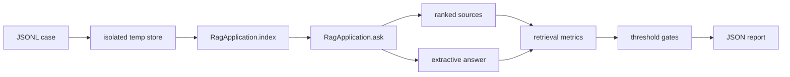

# RAGX Evals

## 1. 目的

单元测试回答“函数和模块是否按代码契约运行”，evals 回答“RAG 系统是否仍能找到正确证据，并基于证据给出允许的答案”。

RAGX 使用两层评测：

| 层级 | 当前状态 | 作用 |
| --- | --- | --- |
| 离线确定性 eval | 已实现 | 无网络、低成本、可重复，作为 PR 第一层质量门禁 |
| 在线模型 eval | 已规划 | 检测模型升级、prompt 变化、幻觉、成本和供应商漂移 |

现有 `ragx_cli.py evaluate` 是单次检索诊断入口，不等同于完整 eval suite。完整 suite 还负责数据集版本、阈值、逐 case 隔离、聚合指标、报告和退出码。

## 2. 目录

```text
evals/
├── datasets/
│   └── core-rag.jsonl        # 离线核心场景
└── thresholds.json           # 发布门槛

rag/evals/
├── models.py                 # case、threshold、result、report 契约
├── runner.py                 # 隔离执行、指标、hash 和 gate
├── __main__.py               # python -m rag.evals
└── __init__.py               # 公共 API
```

## 3. 执行

只输出报告：

```bash
python3 -m rag.evals
```

质量门槛失败时返回非零状态：

```bash
python3 -m rag.evals --fail-on-regression
```

保存报告：

```bash
python3 -m rag.evals \
  --dataset evals/datasets/core-rag.jsonl \
  --thresholds evals/thresholds.json \
  --output .ragx/evals/core-rag.json \
  --fail-on-regression
```

CI 和发布流程必须使用 `--fail-on-regression`。本地诊断可以省略该参数，以便在门禁失败时仍查看完整报告。

## 4. 执行模型

每个 case 使用：

1. 独立临时目录。
2. 独立 SQLite 向量库和 manifest。
3. case 自己声明的合成文档。
4. 确定性 hashing embedding。
5. 真实 RAGX 版面、分块、索引、混合召回、RRF 和重排实现。
6. 从第一条证据抽取正文的确定性生成 provider。
7. 完成后关闭 store 并删除全部临时数据。



确定性 provider 不模拟真实模型能力。它的作用是：

- 验证 prompt 是否包含正确证据。
- 验证生成阶段拿到的第一证据是否支持关键事实。
- 让 PR eval 无网络费用、不受模型随机性影响。
- 把真实模型质量留给独立的在线 shadow eval。

## 5. 数据契约

JSONL 每行是一个完整 case：

```json
{
  "case_id": "expense-deadline",
  "category": "policy-fact",
  "description": "Expense policy retrieval.",
  "documents": [
    {
      "source": "expense-policy.md",
      "content": "# 财务制度\n\n员工应在 3 天内提交发票和审批单。"
    },
    {
      "source": "deployment-guide.md",
      "content": "# 部署\n\n发布前检查服务端口和健康状态。"
    }
  ],
  "query": "报销材料几天内提交？",
  "relevant_sources": [
    "expense-policy.md"
  ],
  "expected_answer_terms": [
    "3 天",
    "发票"
  ],
  "forbidden_answer_terms": [
    "7 天"
  ],
  "top_k": 3
}
```

约束：

- `case_id` 在一个数据集中必须唯一。
- `case_id` 和 `category` 必须是小写连字符 slug。
- `source` 只能是安全 basename，禁止绝对路径和 `..`。
- `relevant_sources` 必须存在于本 case 的 documents。
- `relevant_sources`、期望 term 和禁用 term 内部不能重复。
- 同一个 term 不能同时出现在 expected 与 forbidden 集合。
- 每个 case 至少有一个相关 source 和一个答案关键 term。
- 核心集要求每个 case 至少包含一份干扰文档和一个 forbidden term。
- 文档必须是合成或脱敏内容，不能把生产敏感数据写入仓库。

## 6. 指标与门槛

| 指标 | 定义 | 当前门槛 |
| --- | --- | ---: |
| `case_pass_rate` | 检索、答案 term、禁用 term 和 grounding 全部通过的 case 比例 | 1.0 |
| `hit_rate_at_1` | 第一条证据 source 正确的 case 比例 | >= 0.75 |
| `hit_rate_at_3` | 前三条包含相关 source 的 case 比例 | 1.0 |
| `mrr` | 第一条相关 source 的平均倒数排名 | >= 0.85 |
| `answer_term_recall` | 期望答案 term 的总命中率 | 1.0 |
| `grounded_answer_rate` | 答案可在返回 contexts 中找到的 case 比例 | 1.0 |
| `forbidden_term_violation_rate` | 答案出现禁止事实的 case 比例 | 0.0 |
| `p95_case_latency_ms` | 本地检索与确定性生成 P95 | <= 250ms |

延迟门槛只用于检测本地算法突变，不是生产 Service-Level Objective (SLO)。

单个 case 通过条件：

```text
relevant_rank <= 3
AND all expected_answer_terms are present
AND no forbidden_answer_terms are present
AND answer is grounded in returned contexts
```

## 7. 可复现报告

报告包含：

- suite 与 evaluator version。
- dataset 文件名和 SHA-256。
- thresholds SHA-256。
- UTC 生成时间。
- 按 `category` 汇总的覆盖数量。
- 聚合 metrics、thresholds 和 failed gates。
- 每个 case 的排名、答案 term、grounding、延迟和诊断。

dataset 或 threshold 变化会改变 hash。比较两个报告时，应先确认 hash 是否一致，避免把数据集变化误判为模型或算法回归。

当前 `evaluator_version` 为 `2`。版本 2 在报告中加入 `coverage` 类别计数，并把 case `category` 写入逐项 diagnostics；消费报告的脚本应按版本解析新增字段。

## 8. 当前核心覆盖

核心集当前包含 16 个 case、15 个类别：

| 类别 | Case | 主要风险 |
| --- | --- | --- |
| `policy-fact` | `expense-deadline`、`incident-response` | 中文制度事实、时限与通知对象 |
| `structure` | `table-chunking` | 表格切分和表头语义保留 |
| `configuration` | `configuration-precedence` | `.env` 与进程变量优先级 |
| `exact-match` | `exact-error-code` | 错误码、标识符和近似干扰项 |
| `semantic-rewrite` | `rollback-synonym` | 回滚/发布回退等同义表达 |
| `metadata-signal` | `heading-retention-policy` | 标题和来源字段对排序的贡献 |
| `numeric-disambiguation` | `numeric-severity-disambiguation` | 相邻等级和数字事实混淆 |
| `mixed-language` | `prompt-cache-mixed-language` | 中英混合术语与配置字段 |
| `long-context` | `long-document-tail` | 长文档尾部证据、分块与排序 |
| `security-boundary` | `acl-filter-contract` | ACL 过滤契约的知识检索 |
| `provenance` | `citation-provenance` | page、bbox、content hash 溯源字段 |
| `fusion` | `rrf-fusion-contract` | RRF 排名融合与异构原始分隔离 |
| `versioning` | `latest-version-filter` | 最新版本过滤和旧版本排除 |
| `parent-child` | `parent-child-expansion` | child 命中、parent id 与父块展开 |
| `incremental-index` | `vector-reuse-contract` | content hash 与增量向量复用 |

所有场景都包含至少一个易混淆干扰文档、一个或多个 expected term，以及禁止进入答案的错误事实。`security-boundary` 当前验证 ACL 契约能够被正确检索，不代表已经完成跨租户授权或恶意越权集成测试。

测试层额外验证：

- 默认数据集规模、类别覆盖和 hard-negative 约束。
- 非法 slug、不安全 source、重复 case/source/term。
- expected 与 forbidden term 冲突。
- 未知 threshold 和所有数值边界。
- gate 失败退出码、报告写入与 coverage 序列化。

尚未覆盖：

- 无答案拒答。
- prompt injection 与恶意文档。
- 多跳和跨文档综合。
- graded relevance 与 nDCG。
- PDF 页码/bbox 证据定位。
- ACL 真实隔离、跨通道 filter 下推与越权召回。
- 真正的远程 embedding、LLM、token、成本与超时。
- 十万级以上语料的吞吐和 P95/P99。

这些缺口尚未在本仓库排期，属于后续演进方向。

## 9. 扩展规则

新增质量能力必须同时提交：

1. 至少一个最小正例。
2. 至少一个容易误召回的干扰文档。
3. 必要的 forbidden term 或负例。
4. 对应 aggregate metric。
5. threshold 和失败测试。
6. 文档中的指标定义与边界。

不要把以下内容混入离线核心集：

- 未固定模型版本的真实网络调用。
- 含个人信息或内部密钥的生产样本。
- 依赖执行顺序或历史本地索引的 case。
- 只有人工主观评分、无法稳定重放的判断。

## 10. 在线模型 Eval 设计

在线模型 eval 使用同一 dataset contract 的扩展版本，但单独运行：

1. 固定 model id、endpoint alias、temperature、prompt version 和 schema version。
2. 缓存脱敏后的原始响应，记录 request id、token、耗时和估算成本。
3. 增加 answer correctness、faithfulness、citation precision、拒答准确率和格式合规率。
4. 候选模型先 shadow，不写入生产索引或用户会话。
5. PR 跑小型离线集，nightly 跑在线全量，发布比较已认证基线。
6. 任何豁免必须包含负责人、原因和过期时间。

在线模型 eval 目前只有设计约定，尚未在本仓库实现。
