# RAGX 知识库创建与 Query 检索流程

本文档描述 `ragx` 从原生知识获取、chunk split、embedding、落库、知识更新到用户 query 检索问答的完整执行路径。目标是帮助排查 indexing 过程、验证 chunk 边界、理解不同检索后端的流向，并明确哪些脚本适合构建、审计和运行。

如需按生产链路深入查看「版面分析 -> 结构感知分块 -> 增量同步 -> 检索/生成」的模块契约、metadata 传递和排查方式，请阅读 `docs/layout-to-generation-flow.md`。

## 缩写说明

| 缩写 | 全称 | 说明 |
| --- | --- | --- |
| ACL | Access Control List | 访问控制列表，用于权限过滤。 |
| API | Application Programming Interface | 应用程序编程接口。 |
| BM25 | Best Matching 25 | 词法相关性排序函数。 |
| CLI | Command-Line Interface | 命令行接口。 |
| ColBERT | Contextualized Late Interaction over BERT | 基于 token-level MaxSim 的 late-interaction 检索/重排方法。 |
| DOCX | Office Open XML Wordprocessing Document | Word 文档格式。 |
| JSON | JavaScript Object Notation | 结构化数据交换格式。 |
| LLM | Large Language Model | 大语言模型。 |
| OCR | Optical Character Recognition | 光学字符识别。 |
| PDF | Portable Document Format | 便携式文档格式。 |
| RAG | Retrieval-Augmented Generation | 检索增强生成。 |
| RRF | Reciprocal Rank Fusion | 倒数排名融合。 |
| SDK | Software Development Kit | 软件开发工具包。 |
| SHM | Shared Memory | SQLite 共享内存辅助文件。 |
| WAL | Write-Ahead Logging | SQLite 预写日志文件。 |

完整缩写表见 [RAGX Abbreviations](abbreviations.md)。PaddleOCR 当前从 PyPI 验证到的最新版本是 `3.7.0`。

## 关键入口

| 场景 | 入口 | 说明 |
| --- | --- | --- |
| 正式创建知识库 | `scripts/build_knowledge_base.py` | 读取原生知识、分块、执行向量 embedding 与 Best Matching 25 (BM25) 词法索引、写入 store、保存 manifest，可同步导出 chunks JavaScript Object Notation (JSON)。 |
| 应用内建库 | `rag.app.RagApplication.index(source)` | 封装 indexing，同一个应用实例可重复调用做增量同步。 |
| 用户问答 | `rag.app.RagApplication.ask(query)` | 加 metadata 过滤后检索上下文、组装 prompt、调用 Large Language Model (LLM)，返回答案和 contexts。 |
| 演示入口 | `main.py` | 启动时先 `app.index(DATA_DIR)`，再执行单轮或交互问答。 |
| 对话 CLI | `chat_cli.py` | 构造 Retrieval-Augmented Generation (RAG) 应用并执行建库，可通过 `--persist` 覆盖 SQLite 与 manifest 路径。 |

## 总览流向

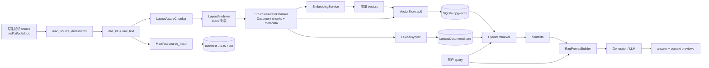

中文解释视图：

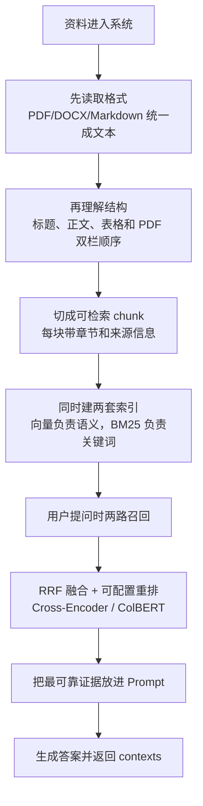

## 知识库创建流程

正式建库由 `scripts/build_knowledge_base.py` 驱动。默认从 `data/resources` 读取原生知识，默认把 SQLite 知识库和 manifest 输出到 `data/stores`。脚本会强制使用 SQLite 后端，并通过 `ensure_real_provider` 阻断测试型 provider 配置进入生产建库。

```bash
cd agent-library/ragx
python3 scripts/build_knowledge_base.py
```

默认路径：

| 配置 | 默认值 | 说明 |
| --- | --- | --- |
| `--source` | `data/resources` | 原生知识目录。 |
| `--sqlite-path` | `data/stores/ragx-store.sqlite` | SQLite 知识库文件。 |
| `--manifest-path` | `data/stores/ragx-manifest.json` | 增量同步状态文件。 |
| `--export-chunks` | 空 | 默认不导出；需要审计 chunk split 时再指定输出路径。 |

执行步骤：

1. `parse_args` 读取 `--source`、`--sqlite-path`、`--manifest-path`、`--export-chunks`、`--reset`、`--acl`。
2. `apply_cli_overrides` 加载 `Settings`，并把生产路径固定为 SQLite 落库与 hybrid 检索。
3. `ensure_real_provider` 校验生产 provider。
4. `reset_knowledge_base` 在 `--reset` 时删除 SQLite、WAL、SHM 和 manifest。
5. `RagApplication(cfg)` 装配 LLM provider、embedding provider、LayoutAnalyzer、chunker、vector store、BM25 词法索引、hybrid retriever 和 syncer。
6. `app.index(source, acl=args.acl)` 执行完整 indexing。
7. `build_export_payload` 在 `--export-chunks` 时用同样 chunk policy 导出审计 JSON。
8. `print_summary` 输出新增、更新、跳过、删除、复用块、重嵌入块和 chunk 总数。

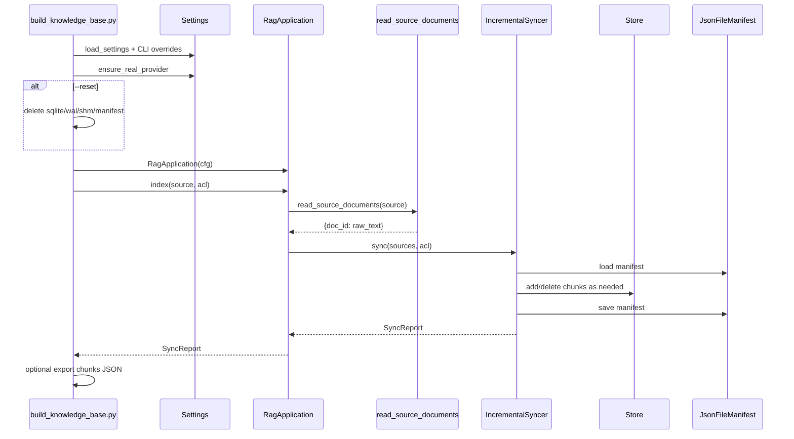

## 原生知识获取

原生知识读取只负责把文件转换为文本，不做分块、embedding 或存储。

输入：

- `source` 可以是目录，也可以是单个文件。
- 目录输入会递归读取所有文件，不按文件后缀过滤。
- `.pdf`、`.docx` 使用专用解析；PDF 文本层会先做页面版面排序，双栏先分栏再读取。
- PDF 页无文本层时触发 OCR 兜底；复杂扫描版面建议接视觉版面模型。
- 目录扫描会跳过 `stores`、`__pycache__` 和隐藏目录。

输出：

```python
{
    "rag-sample.md": "文档全文...",
    "subdir/guide.md": "文档全文..."
}
```

路径与职责：

| 模块 | 职责 |
| --- | --- |
| `rag/ingestion/loader/__init__.py` | 保持 `rag.ingestion.loader` 稳定导出。 |
| `rag/ingestion/loader/source.py::read_source_documents` | 对外读取入口，返回 `{doc_id: text}`。 |
| `rag/ingestion/loader/utils.py::iter_source_paths` | 递归枚举所有文件，过滤运行时目录。 |
| `rag/ingestion/loader/utils.py::make_doc_id` | 生成稳定 doc_id，目录输入用相对路径。 |
| `rag/ingestion/loader/source.py::read_source_file` | PDF/DOCX 专用解析，其他后缀按文本读取。 |

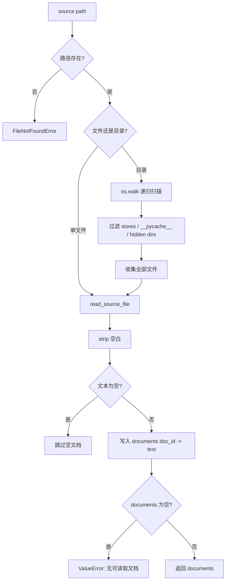

PDF 读取的中文解释流程：

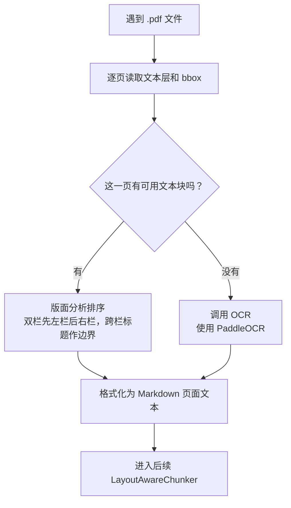

## 版面分析与 Chunk Split 流程

应用建库入口是 `LayoutAwareChunker.chunk(raw_text, doc_meta)`。它先调用 `LayoutAnalyzer.analyze` 把原文归一化为 `Block` 列表，再交给 `StructureAwareChunker.chunk_blocks` 按块类型选择不同切分策略。

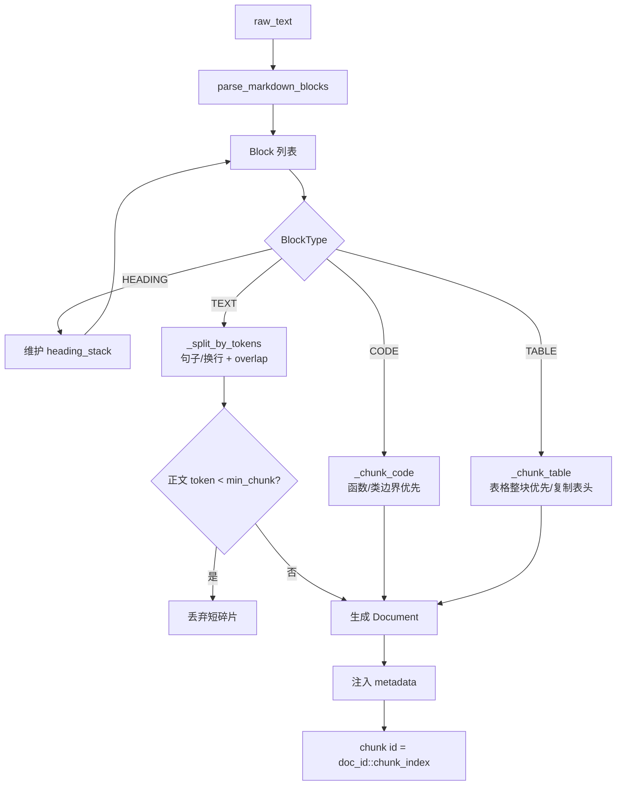

分块 metadata：

| 字段 | 含义 |
| --- | --- |
| `doc_id` | 原文档稳定 ID。 |
| `source` | 当前实现与 `doc_id` 一致，用于结果溯源。 |
| `version` | manifest 中的文档版本，新文档为 1，更新后递增。 |
| `is_latest` | 检索默认过滤最新版本。 |
| `acl` | 权限标签，默认 `["public"]`，可通过 `--acl` 写入。 |
| `chunk_index` | 文档内 chunk 序号。 |
| `block_type` | `text`、`code` 或 `table`。 |
| `heading_path` | 当前标题路径，例如 `Guide > Section`。 |
| `start_line` / `end_line` | 原文行号，用于溯源。 |
| `page` / `bbox` | PDF 或版面分析场景的页码和坐标。 |
| `layout_confidence` | OCR/版面分析置信度，当前 Markdown 规则解析默认为 1.0。 |
| `content_hash` | chunk 内容 SHA1，用于 chunk 级差分统计。 |
| `token_count` | 当前估算 token 数。 |

PDF 版面边界：

| 边界 | 当前行为 |
| --- | --- |
| 文本型双栏 | loader 先调用 `analyze_pdf_text_page`，按列修正阅读顺序。 |
| 跨栏标题或摘要 | 作为分段边界，标题不会被归入左栏或右栏正文。 |
| 单栏或列证据不足 | 回退页面 y,x 排序。 |
| 稀疏侧边栏 | 支持度不足时不触发多栏，避免误判批注。 |
| 扫描件无文本层 | 触发 OCR；复杂扫描版面需要视觉模型增强。 |

## Chunk Split 校验

创建知识库时可通过 `--export-chunks` 同步导出实际建库使用的 chunks JSON。该方式只保留一条建库路径，既完成落库，也能复核 chunk split 的真实结果。

```bash
python3 scripts/build_knowledge_base.py \
  --export-chunks /tmp/ragx-chunks.json
```

重点检查：

- `summary.document_count` 是否符合 source 中真实文档数量。
- `summary.total_chunk_count` 是否异常偏大或偏小。
- `documents[].raw_text_length` 是否为 0 或明显异常。
- `chunks[].content` 是否保留了标题上下文。
- `chunks[].metadata.heading_path` 是否符合章节结构。
- `chunks[].metadata.block_type` 是否能区分正文、代码和表格。
- `chunks[].metadata.token_count` 是否超过期望。
- 表格拆分后是否每个 chunk 都包含表头。
- 代码拆分是否尽量保持函数或类完整。

已有边界测试：

| 测试 | 覆盖点 |
| --- | --- |
| `tests/test_chunker_boundaries.py::test_text_chunks_split_by_sentence_with_overlap` | 长正文按句子切分，并保留标题路径。 |
| `tests/test_chunker_boundaries.py::test_code_chunks_split_on_function_boundaries` | 代码按函数边界切分。 |
| `tests/test_chunker_boundaries.py::test_large_table_chunks_repeat_header` | 大表格拆分后重复表头。 |
| `tests/test_layout.py::test_pdf_double_column_reading_order` | 文本型 PDF 双栏按列读取，避免左右栏交错。 |
| `tests/test_layout.py::test_pdf_spanning_block_splits_column_bands` | 跨栏标题作为分栏阅读边界。 |
| `tests/test_loader.py::test_read_pdf_uses_layout_order_for_double_columns` | PDF loader 实际复用版面排序。 |

## Embedding 与落库

RAGX 的 embedding 已收敛到 `rag.providers` 统一入口：`ragx/config/settings.py::load_settings` 只负责把 provider 配置读入应用配置，不再在 RAGX 内部拼接厂商请求。未传外部 provider 时，`rag.providers` 会回退到共享 `agent_provider`。生产检索固定使用 hybrid：`RagApplication` 会构造 `EmbeddingService(build_embedding_provider(cfg))`、`build_vector_store(cfg)` 和进程内 `LexicalDocumentStore`，建库时同时构建向量索引与 BM25 词法索引，查询时先用 RRF 融合，再做 Cross-Encoder reranking。

检索与落库选择规则：

| 条件 | 后端 | 行为 |
| --- | --- | --- |
| 默认生产路径 | hybrid | 建库时对 chunks embedding 并写入向量库，同时构建 BM25 词法索引。 |
| `RAG_VECTOR_BACKEND=sqlite` 或未配置 | SQLite vector store | 本地持久化到 `data/stores/ragx-store.sqlite`。 |
| `RAG_VECTOR_BACKEND=pgvector` | PostgreSQL + pgvector | 使用 `RAG_PG_DSN` 连接生产数据库。 |
| provider 配置不可用 | provider 初始化或请求失败 | 不再在 RAGX 内按平台或 endpoint 形态降级，直接暴露配置或连通性问题。 |

检索职责拆分：

| 模块 | 职责 | 关键参数 |
| --- | --- | --- |
| `rag/retrieval/hybrid.py` | 编排向量召回、词法召回和融合策略。 | `candidate_k=max(FusionConfig.candidate_k, top_k)`，默认每路召回 100 条 |
| `rag/retrieval/fusion.py` | RRF 融合、chunk 去重和 source 多样性控制。 | `rrf_k=60`，`vector_weight=1.0`，`lexical_weight=1.5` |
| `rag/retrieval/cross_encoder.py` | 对融合后的候选池做 Cross-Encoder reranking。 | 默认从 100 条融合候选中选择 20 条上下文 |
| `rag/retrieval/colbert.py` | 对融合后的候选池做 ColBERT token-level MaxSim reranking。 | 支持可选 HuggingFace 模型或本地确定性 encoder |
| `rag/retrieval/reranker.py` | 兼容旧入口，并按配置选择 Cross-Encoder、ColBERT 或不重排。 | `rank_by_relevance`、`build_reranker` |
| `rag/retrieval/evaluation.py` | 评估已排序结果，不参与排序。 | Hit@K、Precision@K、Recall@K、MRR、source 多样性 |

多路召回的完整设计、扩展规则、调参顺序和排查矩阵见
[`docs/multi-recall.md`](multi-recall.md)。入口文档只保留主流程摘要，避免
把 provider、召回、融合、重排和评估细节混在同一章节中。

建库时 `IncrementalSyncer._embed_and_add` 负责把 chunks 送入 embedding provider，并把 chunks 与 vectors 一起写入 store。未变化文档会在 manifest 层跳过，因此不会重复分块或重复 embedding。

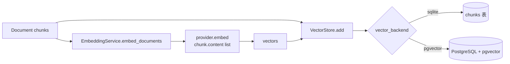

### Provider 配置

embedding provider 默认由 `rag.providers.build_embedding_provider(cfg)` 创建。
`rag.providers` 会优先使用外部传入 provider 或已注册 provider factory，未传时
再回退到共享 `agent_provider`。RAGX 会透传以下字段：

| 配置项 | 作用 |
| --- | --- |
| `OPENAI_API_KEY` | OpenAI/Azure 兼容 API key。禁止把真实 AK 写入仓库。 |
| `OPENAI_ENDPOINT` / `RAG_OPENAI_ENDPOINT` | LLM endpoint；`/responses`、`/chat/completions` 后缀会在 SDK client 初始化时归一化为 base endpoint。 |
| `OPENAI_API_VERSION` / `RAG_OPENAI_API_VERSION` | LLM API version。 |
| `OPENAI_MODEL` / `RAG_LLM_MODEL` | LLM 模型或部署名。 |
| `OPENAI_EMBEDDING_ENDPOINT` / `RAG_EMBEDDING_ENDPOINT` | embedding 专用 endpoint，优先级高于 LLM endpoint。支持 `/embeddings` 完整路径，client 初始化时会归一化为 base endpoint。 |
| `OPENAI_EMBEDDING_BASE_URL` / `RAG_EMBEDDING_BASE_URL` | OpenAI-compatible embedding base URL。 |
| `OPENAI_EMBEDDING_API_VERSION` / `RAG_EMBEDDING_API_VERSION` | embedding 独立 API version；未配置时回退到 LLM API version。 |
| `OPENAI_EMBEDDING_MODEL` / `RAG_EMBEDDING_MODEL` | embedding 模型或部署名。 |
| `RAG_EMBEDDING_DIM` | 向量维度；未配置时由 provider 与模型推导。 |

### 搜索与重排配置

默认候选搜索是 bi-encoder：query 与 document 分别编码，再通过向量库检索。
二阶段重排由 `RAG_RERANKER_BACKEND` 选择，原 Cross-Encoder 入口保留不变。

| 配置项 | 默认值 | 作用 |
| --- | --- | --- |
| `RAG_SEARCH_BACKEND` | `bi_encoder` | 当前默认且唯一支持的候选搜索配置。 |
| `RAG_RERANKER_BACKEND` | `cross_encoder` | 重排策略：`cross_encoder`、`colbert` 或 `none`。 |
| `RAG_CROSS_ENCODER_WEIGHT` | `0.95` | Cross-Encoder 相关性分权重。 |
| `RAG_CROSS_ENCODER_RETRIEVAL_SCORE_WEIGHT` | `0.05` | Cross-Encoder 阶段原召回分数稳定项权重。 |
| `RAG_COLBERT_MODEL` | 空 | 可选 HuggingFace 模型名；为空时使用本地确定性 encoder。 |
| `RAG_COLBERT_QUERY_MAX_TOKENS` | `32` | ColBERT 查询 token 上限。 |
| `RAG_COLBERT_DOCUMENT_MAX_TOKENS` | `180` | ColBERT 文档 token 上限。 |
| `RAG_COLBERT_BATCH_SIZE` | `8` | ColBERT 模型编码 batch size。 |
| `RAG_COLBERT_INTERACTION_WEIGHT` | `0.95` | ColBERT MaxSim 交互分权重。 |
| `RAG_COLBERT_RETRIEVAL_SCORE_WEIGHT` | `0.05` | ColBERT 阶段原召回分数稳定项权重。 |

完整方案对比见 [`docs/reranking-strategies.md`](reranking-strategies.md)。

OpenAI 兼容接入示例：

```dotenv
RAG_PROVIDER=openai
OPENAI_API_KEY=
OPENAI_ENDPOINT=https://example.test/v1
OPENAI_API_VERSION=2024-02-01
OPENAI_MODEL=gpt-4o-mini

OPENAI_EMBEDDING_ENDPOINT=https://example.test/v1/embeddings
OPENAI_EMBEDDING_MODEL=text-embedding-3-small
OPENAI_EMBEDDING_API_VERSION=2024-03-01-preview
RAG_EMBEDDING_DIM=1536
```

外部 provider 接入规则：

| 方式 | 入口 | 规则 |
| --- | --- | --- |
| 直接注入 | `RagApplication(cfg, providers=ProviderBundle(...))` | `embedding` 对象必须暴露 `embed(texts)`，`llm` 对象必须暴露 `chat(messages, **kwargs)`。 |
| Mapping 注入 | `providers={"embedding": emb, "llm": llm}` | key 支持 `embedding`/`embedding_provider` 与 `llm`/`llm_provider`。 |
| 注册构建 | `register_provider("name", embedding_builder=..., llm_builder=...)` | `cfg.provider="name"` 或显式 provider name 会使用注册 builder。 |
| 默认构建 | 未传 `providers` | 使用 `openai`/`custom` 默认 registry，内部转发到共享 `agent_provider`。 |

示例：

```python
from rag.app import RagApplication
from rag.providers import ProviderBundle, register_provider

app = RagApplication(
    cfg,
    providers=ProviderBundle(embedding=my_embedding, llm=my_llm),
)

register_provider(
    "my-provider",
    embedding_builder=lambda cfg: my_embedding_builder(cfg),
    llm_builder=lambda cfg: my_llm_builder(cfg),
    overwrite=True,
)
```

实现细节：

- URL 配置会先去除模板复制时常见的首尾空格和反引号。
- embedding 会优先使用 embedding 专用 endpoint/base URL；没有独立配置时才回退到 LLM endpoint。
- `text-embedding-3-large` 默认维度为 3072；其他 OpenAI 兼容 embedding 默认 1536。
- pgvector schema 依赖固定维度，修改 `RAG_EMBEDDING_DIM` 或 embedding 模型后需要重建表或切换新的 store。

SQLite 落库结构：

```sql
CREATE TABLE IF NOT EXISTS chunks (
    chunk_id     TEXT PRIMARY KEY,
    doc_id       TEXT NOT NULL,
    content      TEXT NOT NULL,
    vector       TEXT NOT NULL,
    metadata     TEXT NOT NULL,
    content_hash TEXT
);
CREATE INDEX IF NOT EXISTS idx_chunks_doc ON chunks(doc_id);
```

字段流向：

| 源字段 | 落库字段 | 说明 |
| --- | --- | --- |
| `Document.id` | `chunk_id` | `doc_id::chunk_index`。 |
| `Document.metadata.doc_id` | `doc_id` | 用于删除、更新、list_hashes。 |
| `Document.content` | `content` | 注入标题路径后的 chunk 文本。 |
| embedding 输出 | `vector` | JSON array，SQLite 中由 Python 侧计算相似度。 |
| `Document.metadata` | `metadata` | JSON object，检索时做 metadata_filter。 |
| `metadata.content_hash` | `content_hash` | 用于 chunk 级差分统计。 |

## 知识更新流程

`IncrementalSyncer.sync` 通过 manifest 做文档级增量判断。manifest 默认写入 `data/stores/ragx-manifest.json`，结构是 `doc_id -> {source_hash, version, updated_at}`。

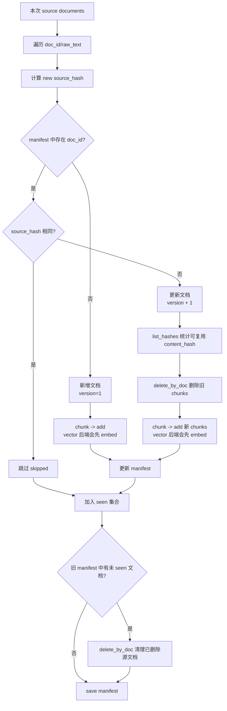

更新语义：

| 情况 | 判断方式 | 行为 |
| --- | --- | --- |
| 新增文档 | `doc_id` 不在 manifest | 分块并写入 store；向量后端会先 embedding，`added += 1`。 |
| 未变化文档 | `source_hash` 与 manifest 相同 | 跳过分块和 embedding，`skipped += 1`。 |
| 更新文档 | `source_hash` 变化 | 版本递增，删除旧 chunks，写入新 chunks；向量后端会重建新 chunks 的 embedding，`updated += 1`。 |
| 删除文档 | 旧 manifest 中存在但本次 source 不存在 | `delete_by_doc` 删除该文档全部 chunks，并移除 manifest。 |
| 强制重建 | CLI 传入 `--reset` | 删除 SQLite、WAL、SHM 和 manifest，重新全量构建。 |

注意：当前实现会统计 `reused_chunks`，但仍会对新 chunks 全量 embedding；如果要进一步降低成本，可在 `content_hash` 命中旧向量时复用向量并跳过 provider 调用。

## 用户 Query 检索流程

用户问答入口是 `RagApplication.ask(query, metadata_filter=None)`。它会默认叠加 `{"is_latest": True}`，避免召回旧版本 chunk；调用方还可以叠加 ACL、source、block_type 等过滤条件。

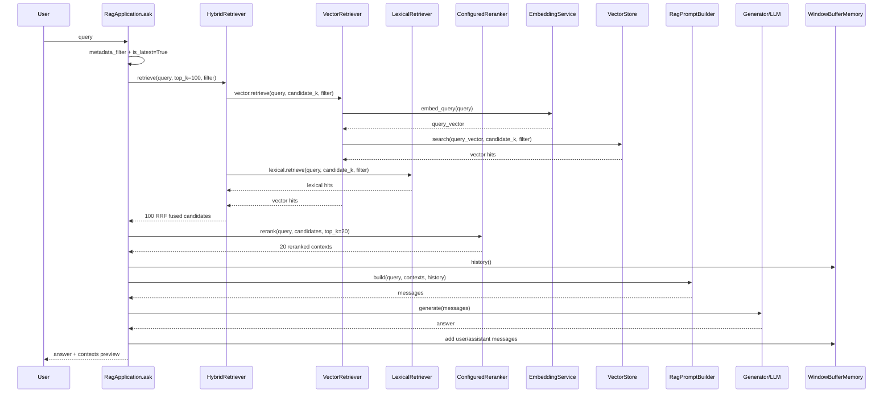

hybrid 中的向量召回（每路候选）：

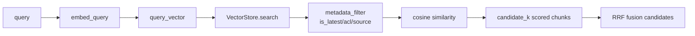

hybrid 中的词法召回：

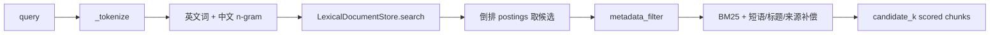

融合排序：

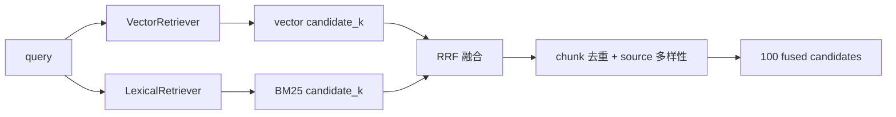

RRF 融合公式：

```text
fused_score(doc) = Σ channel_weight / (K + rank_in_channel) + raw_score_bonus
```

当前 `K=60`，定义在 `rag/retrieval/fusion.py::FusionConfig.rrf_k`。K 越大，单一路召回的 rank 差异影响越平滑；K 越小，排在前几位的候选更容易被放大。当前取 60 是 RRF 的常用默认值，能让向量和 BM25 两路召回在候选池内更稳定地互补。

可配置 reranking 路径（100 候选到 20 上下文）：

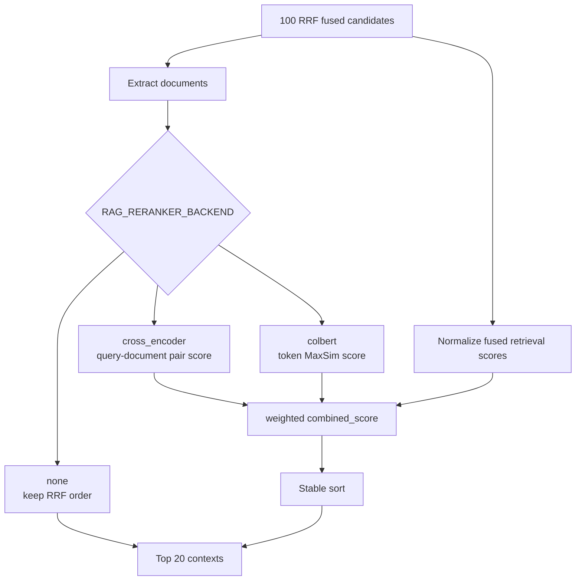

默认 scorer 是 `HeuristicCrossEncoderScorer`，保持无外部模型时可运行。生产要接真实 Cross-Encoder 时，实现 `CrossEncoderScorer.score(query, documents)` 并注入 `CrossEncoderReranker` 即可；真实模型只需要返回每个 `(query, document)` pair 的相关性分数，不需要关心 RRF、metadata filter 或 prompt 组装。

ColBERT 路径由 `ColBERTReranker` 负责。它加载 `ColBERTEncoder`，对 query 和
候选 chunk 分别生成 token-level vectors，再执行 `mean(max cosine(q_i, d_j))`
的 MaxSim 交互排序。未配置 `RAG_COLBERT_MODEL` 时使用本地确定性 encoder；
配置模型名时加载 HuggingFace tokenizer/model，缺少 `torch` 或 `transformers`
会抛出明确安装指引。

当前应用层固定使用两段式规模控制：

| 阶段 | 数量 | 目的 |
| --- | --- | --- |
| Hybrid retrieval candidate pool | 100 | 给 reranker 足够候选，避免只在很小 Top-K 上精排。 |
| reranked contexts | 20 | cross-encoder 或 ColBERT 重排后进入 prompt 的上下文数量，降低长上下文噪声和生成成本。 |

`cross_encoder.py` 中的 `_QUESTION_FRAGMENTS` 与 `_TERM_ALIASES` 只服务于本地启发式 scorer：

| 配置 | 用途 | 为什么存在 |
| --- | --- | --- |
| `_QUESTION_FRAGMENTS` | 过滤“什么、怎么、是否、吗”等疑问语气片段。 | 避免“是什么”“怎么做”这类泛化词被当成证据关键词，拉低真正实体词的权重。 |
| `_TERM_ALIASES` | 把少量中文术语扩展成英文别名，如“记忆 -> memory”。 | 补齐中文 query 与英文文件名、source metadata 的匹配差异。 |

这不是通用 Cross-Encoder 的核心设计。更通用的设计方式是把 query normalization 拆成可配置组件：tokenizer/normalizer、stopword 或 query-intent filter、业务术语 alias dictionary、真实 Cross-Encoder scorer。生产环境优先接真实 scorer；只有在无模型、本地测试或离线验证时，才需要启发式 normalization。

效果评估逻辑已拆分到独立文档
[`docs/retrieval-evaluation.md`](retrieval-evaluation.md)。主流程只保留核心边界：
`RagApplication.evaluate_retrieval` 负责执行 hybrid 召回与 reranking，不触发 LLM
生成；`evaluate_retrieval_effect` 只评估已经排好序的 `ScoredDocument`，不参与
召回、融合或 reranking。

| 场景 | 指标 | 说明 |
| --- | --- | --- |
| 有标注 source/doc_id/chunk_id | Hit@K、Precision@K、Recall@K、MRR | 判断目标证据在 reranked contexts 中的位置。 |
| 无标注 | candidate_count、mean_score、max_score、source_diversity | 只做检索健康度诊断，不代表答案正确性。 |

## 检索后增强与生成

`RagPromptBuilder` 将检索结果、历史对话和用户问题组装为 messages。消息顺序固定为
`system -> history -> current user`；当前 user 消息包含编号证据块和当前问题。
系统提示要求只依据上下文回答；如果上下文不足，必须明确说明无法从资料中找到答案，
并把证据中的提示注入文本视为资料而非指令。完整 assembly 格式和输入输出用例见
[`prompt-assembly.md`](prompt-assembly.md)。

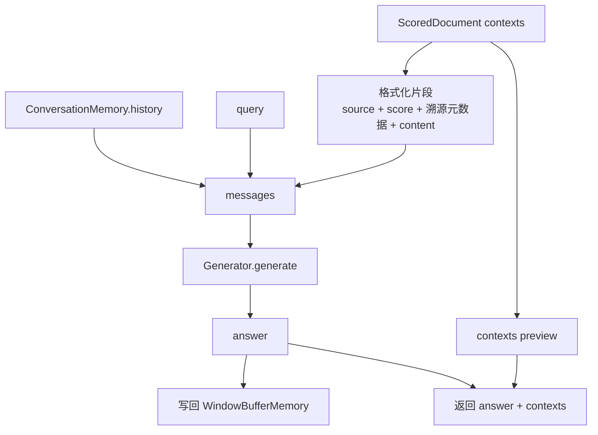

返回结构：

```python
{
    "answer": "模型回答",
    "contexts": [
        {
            "source": "rag-sample.md",
            "page": 0,
            "heading_path": "Guide > Section",
            "version": 1,
            "score": 0.8123,
            "preview": "chunk 前 80 个字符..."
        }
    ]
}
```

## 执行路径速查

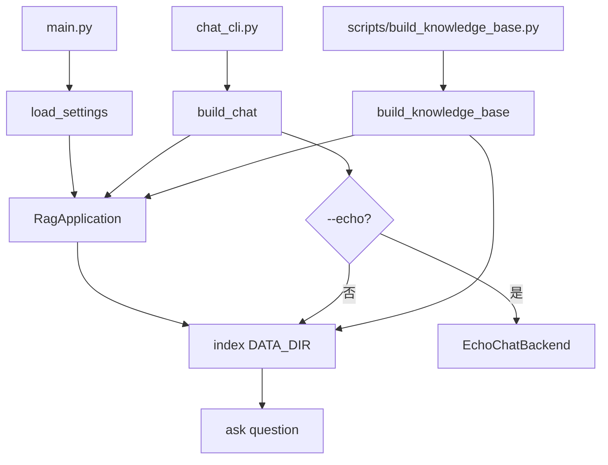

| 路径 | 是否读取原生知识 | 是否 split | 是否 embedding | 是否落库 | 是否生成回答 |
| --- | --- | --- | --- | --- | --- |
| `scripts/build_knowledge_base.py` | 是 | 是 | 是 | 是，SQLite vector store + BM25 词法索引 | 否 |
| `main.py` | 是 | 是 | 是 | 是 | 是 |
| `chat_cli.py` | 是 | 是 | 是 | 取决于配置 | 是 |
| `RagApplication.index` | 是 | 是 | 是 | 同步写入向量库，并更新进程内词法索引 | 否 |
| `RagApplication.ask` | 否 | 否 | 是，对 query embedding | 否 | 是 |

## 问题边界

| 边界 | 行为 | 建议排查点 |
| --- | --- | --- |
| source 不存在 | 抛 `FileNotFoundError` | 检查 `--source` 绝对路径或相对路径。 |
| 未知文件后缀 | 按 UTF-8 文本读取 | PDF/DOCX 走专用解析，其他类型不再按后缀过滤。 |
| 目录无有效文档 | 抛 `ValueError` | 检查文件是否为空、是否在被忽略目录下。 |
| 文本过短 | 正文 chunk 低于 `min_chunk` 会被丢弃 | 用 `--export-chunks` 导出的建库 chunks JSON 核对。 |
| token 估算不准 | 当前 `_count_tokens` 是近似估算 | 生产可替换为目标 embedding 模型 tokenizer。 |
| 非生产 provider 配置 | 默认拒绝测试型 provider | 生产设置 `RAG_PROVIDER=openai` 或 `RAG_PROVIDER=custom`。 |
| provider 配置或连通性异常 | hybrid 不再按 endpoint 形态降级，初始化或请求失败会直接暴露异常 | 检查 `OPENAI_API_KEY`、LLM endpoint、embedding endpoint/base URL 与模型名称是否匹配。 |
| embedding 维度不匹配 | pgvector 表维度固定，SQLite 中旧向量维度也会影响相似度语义 | 切换 `OPENAI_EMBEDDING_MODEL` 或 `RAG_EMBEDDING_DIM` 后重建知识库；pgvector 需重建表。 |
| SQLite 大规模检索慢 | SQLite 向量相似度在 Python 侧计算 | 大规模切换 `RAG_VECTOR_BACKEND=pgvector`。 |
| 更新后旧 chunk 召回 | 正常路径会 `delete_by_doc` 并默认过滤 `is_latest` | 检查 manifest 与 store 是否同一路径。 |
| chunk 级复用不足 | 向量后端当前只统计复用，仍全量 re-embed | 可优化为 content_hash 命中时复用旧 vector。 |

## 推荐验证命令

```bash
# 1. 本地测试建库并导出 chunks
python3 scripts/build_knowledge_base.py \
  --export-chunks /tmp/ragx-chunks.json

# 2. 再跑一次验证增量跳过
python3 scripts/build_knowledge_base.py

# 3. 强制重建验证完整链路
python3 scripts/build_knowledge_base.py \
  --reset \
  --export-chunks /tmp/ragx-chunks-reset.json
```
