# RAGX 版面分析到检索生成全流程

本文档说明 `ragx` 中「版面分析 -> 结构感知分块 -> 增量同步 -> 检索/生成」的完整生产链路。它聚焦模块职责、数据结构、metadata 传递、版本一致性和排查方式，便于维护建库、检索质量与生成结果。

## 缩写说明

| 缩写 | 全称 | 说明 |
| --- | --- | --- |
| ACL | Access Control List | 访问控制列表，用于检索过滤。 |
| BM25 | Best Matching 25 | 词法相关性排序函数。 |
| CJK | Chinese, Japanese, and Korean | 中日韩字符集合。 |
| DOCX | Office Open XML Wordprocessing Document | Word 文档格式。 |
| JSON | JavaScript Object Notation | 结构化数据交换格式。 |
| LLM | Large Language Model | 大语言模型。 |
| MRR | Mean Reciprocal Rank | 平均倒数排名。 |
| OCR | Optical Character Recognition | 光学字符识别。 |
| PDF | Portable Document Format | 便携式文档格式。 |
| RAG | Retrieval-Augmented Generation | 检索增强生成。 |
| RRF | Reciprocal Rank Fusion | 倒数排名融合。 |

完整缩写表见 [RAGX Abbreviations](abbreviations.md)。PaddleOCR 当前从 PyPI 验证到的最新版本是 `3.7.0`。

## 1. 总览

RAGX 的应用入口是 `rag.app.RagApplication`。它是 Composition Root，负责把配置、provider、版面分析、分块、向量库、词法索引、混合检索、重排、prompt 构造和 Large Language Model (LLM，大语言模型) 生成统一装配起来。本文也记录分块、Reciprocal Rank Fusion (RRF，倒数排名融合)、reranker 与评估指标的关键实现口径。

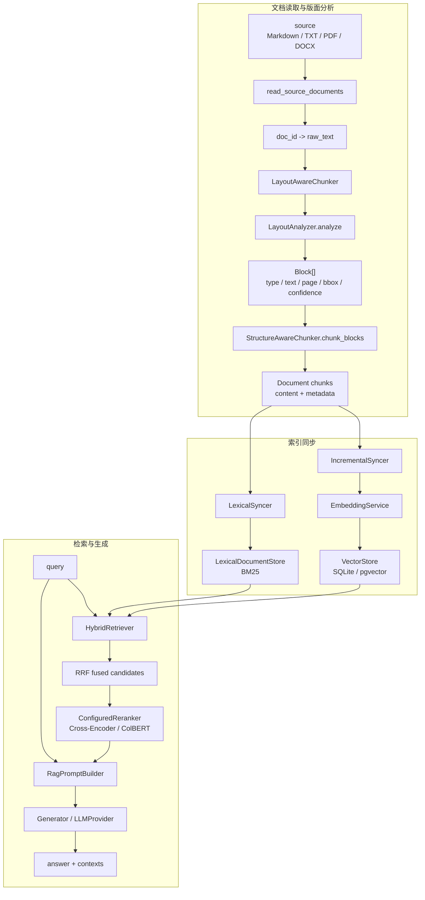

中文解释视图：

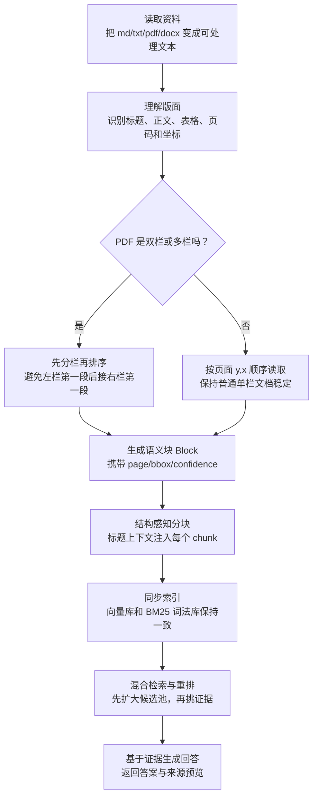

关键实现路径：

| 阶段 | 模块 | 职责 |
| --- | --- | --- |
| 配置与 Provider | `config/settings.py`, `agent_provider` | 读取 provider、embedding、vector store、chunk 参数。 |
| 原始文档读取 | `rag/ingestion/loader/source.py` | 把目录或文件读取成 `{doc_id: raw_text}`。 |
| 版面分析 | `rag/ingestion/layout.py` | 把文本或页面归一化为 `Block` 列表。 |
| 结构感知分块 | `rag/ingestion/chunker.py` | 根据标题、正文、代码、表格生成可索引 `Document`。 |
| 增量同步 | `rag/ingestion/sync.py` | 使用 manifest 判断新增、更新、删除、跳过。 |
| 向量索引 | `rag/embedding/service.py`, `rag/vectorstore/*` | embedding chunk 并写入向量库。 |
| 词法索引 | `rag/retrieval/lexical.py` | 构建 BM25 倒排索引。 |
| 混合检索 | `rag/retrieval/hybrid.py`, `rag/retrieval/fusion.py` | 向量召回 + 词法召回 + RRF 融合。 |
| 重排 | `rag/retrieval/reranker.py`, `rag/retrieval/cross_encoder.py`, `rag/retrieval/colbert.py` | 按配置对融合候选做 Cross-Encoder、ColBERT 或 no-op 排序。 |
| 生成 | `rag/augmentation/prompt_builder.py`, `rag/generation/generator.py` | 组装上下文、历史和问题，调用 LLM 返回答案。 |

## 2. 版面分析

版面分析层的统一契约是 `Block`。无论上游来自 Markdown 规则解析、文本型 PDF 坐标聚类、OCR、视觉版面模型或未来 HTML 正文抽取，下游只消费同一种结构。

```python
Block(
    type=BlockType.TEXT,
    text="正文内容",
    level=0,
    start_line=10,
    end_line=15,
    page=1,
    bbox=(10.0, 20.0, 400.0, 90.0),
    confidence=0.98,
)
```

字段含义：

| 字段 | 说明 |
| --- | --- |
| `type` | `heading`、`text`、`code`、`table`、`image`。 |
| `text` | 归一化后的块文本。 |
| `level` | 标题层级，仅对 `heading` 有意义。 |
| `start_line` / `end_line` | 文本源行号。 |
| `page` | PDF 或分页文档页码；无分页时为 0。 |
| `bbox` | 页面坐标 `(x0, y0, x1, y1)`，用于原文高亮或点击跳转。 |
| `confidence` | 版面检测或 OCR 置信度；规则解析默认为 1.0。 |

当前实现包括三类 analyzer：

| Analyzer | 输入 | 输出 | 当前用途 |
| --- | --- | --- | --- |
| `MarkdownLayoutAnalyzer` | Markdown 或纯文本内容 | `Block[]` | 默认生产链路使用，零依赖。 |
| `PdfTextLayoutAnalyzer` | PDF 路径 | `Block[]`，包含页码和 bbox | 文本型 PDF 按页检测双栏/多栏并输出稳定阅读顺序。 |
| `ModelLayoutAnalyzer` | PDF 或图片路径 | `Block[]` | 视觉模型接入骨架，默认抛 `NotImplementedError`。 |

`RagApplication` 当前通过 `LayoutAwareChunker` 显式串联：

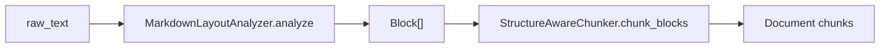

中文解释视图：

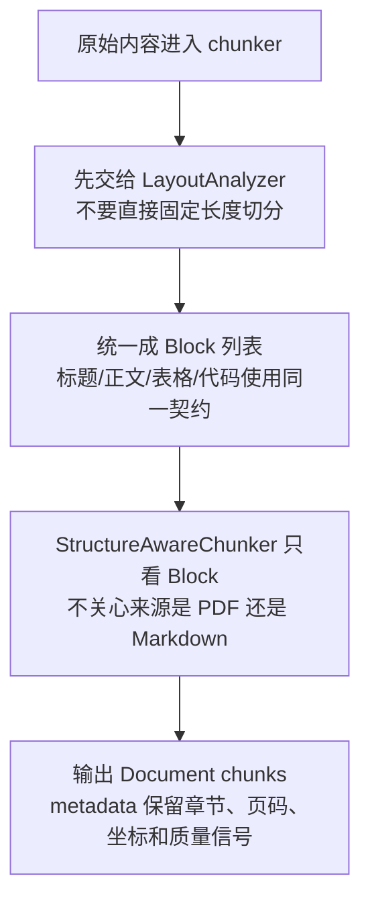

这样做的意义是让版面分析成为独立可替换节点。默认分块路径仍保持 Markdown/纯文本规则解析的稳定行为；PDF loader 已复用 `analyze_pdf_text_page` 修正文本型 PDF 的双栏阅读顺序。未来要把 PDF bbox 直接透传到建库 chunks 时，只需要让 loader 或 syncer 传入更丰富的 Block，不需要改检索和生成链路。

### 2.1 PDF 双栏与边界处理

文本型 PDF 的读取顺序由 `rag/ingestion/layout.py::analyze_pdf_text_page` 负责。它从 PyMuPDF 的 `get_text("dict")` 取得文本块和 bbox 后，不再直接相信默认输出顺序，而是按页执行列检测和阅读顺序排序。

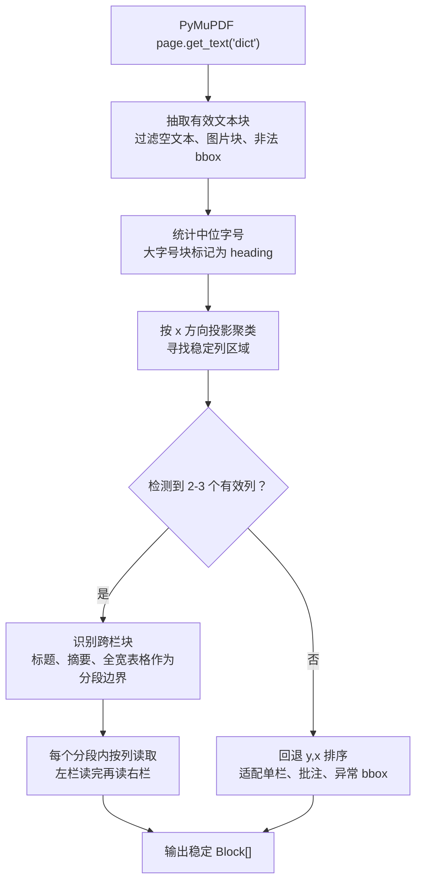

中文解释视图：

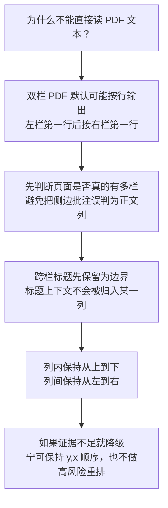

边界 Case 与当前行为：

双栏检测的判定细节如下：

| 判定项 | 当前阈值或条件 | 目的 |
| --- | --- | --- |
| 最少候选块数 | 候选文本块 `< 4` 时直接回退单栏 | 少量文本不足以证明页面存在稳定分栏。 |
| 候选块类型 | 排除 `HEADING` | 标题字号大、常跨栏，不能作为正文列证据。 |
| 候选块文本长度 | `len(text) >= 2` | 过滤页码、孤立符号和噪声。 |
| 候选块宽度 | `bbox_width <= page_width * 0.62` | 宽块大概率是跨栏标题、摘要、全宽段落或表格。 |
| 横向分簇间隔 | `max(page_width * 0.035, 18px)` | 相邻文本块横向空白足够大时才切成新列。 |
| 列数量 | `2 <= column_count <= 3` | 支持双栏和少量三栏；表格型多列或异常布局回退。 |
| 列支持度 | 每列至少有多个块，或文本量达到 `max(40, max_chars * 0.18)` | 防止稀疏侧边栏、批注或脚注被误判为正文列。 |
| 跨栏块判定 | 块宽 `>= page_width * 0.62`，或同时覆盖多个列区域 | 用于识别标题、摘要、跨栏小节或全宽图表说明。 |

具体算法可以理解为“横向投影 + 支持度验证”：

1. 从 PyMuPDF 的 `page.get_text("dict")` 中提取文本块，保留 `(x0, y0, x1, y1)`。
2. 丢弃图片块、空文本块、非法 bbox、标题块和过宽块，只保留可能属于正文列的候选块。
3. 按 `x0` 升序遍历候选块，若当前块 `x0` 与上一簇 `x1` 的距离超过 gap 阈值，则创建新列簇。
4. 对每个列簇累计 `x0/x1` 范围、块数量和字符数。
5. 如果列数不是 2-3，或者某列缺少足够文本支持，则不认为是多栏。
6. 对非跨栏块，使用 bbox 中心点归属到最近列；对跨栏块返回 `-1`，作为阅读分段边界。
7. 在每个跨栏边界之间，按列索引从左到右、列内按 `y,x` 排序。没有跨栏块时，整页按列排序。

这个设计刻意偏保守：只在证据足够强时才启动多栏阅读顺序。原因是双栏误判的损害通常高于漏判。漏判时最多保持 PDF 默认的 `y,x` 顺序；误判时会把页边注释、表格列或脚注插入正文主线，导致 chunk 语义被破坏，进而污染 embedding、BM25 和 reranker。

| 边界 | 当前处理 | 说明 |
| --- | --- | --- |
| 文本型双栏 | 检测 2-3 个有效列，按列内 y,x 排序 | 修复左右栏逐行交错。 |
| 跨栏标题/摘要/全宽段落 | 识别为 spanning block，作为上下分段边界 | 保持标题位于对应段落之前。 |
| 单栏 PDF | 列检测不足时回退 y,x 排序 | 不引入额外重排风险。 |
| 稀疏侧边栏或页边批注 | 列支持度不足时不触发双栏 | 避免批注被当成右栏正文。 |
| 扫描件或无文本层 PDF | `read_pdf` 触发 OCR 兜底 | OCR 只返回文本；复杂版面建议接 `ModelLayoutAnalyzer`。 |
| 表格或多列清单 | 超过 3 个横向簇时回退 y,x 排序 | 防止把表格列误判成页面分栏。 |
| 旋转文字、重叠 bbox、页眉页脚 | 目前不做强删除，异常 bbox 会被过滤 | 对强版式文档应接视觉模型或 LayoutReader。 |

## 3. 结构感知分块

结构感知分块由 `StructureAwareChunker` 完成。它不按固定字符数硬切，而是先维护标题栈，再按块类型选择策略。

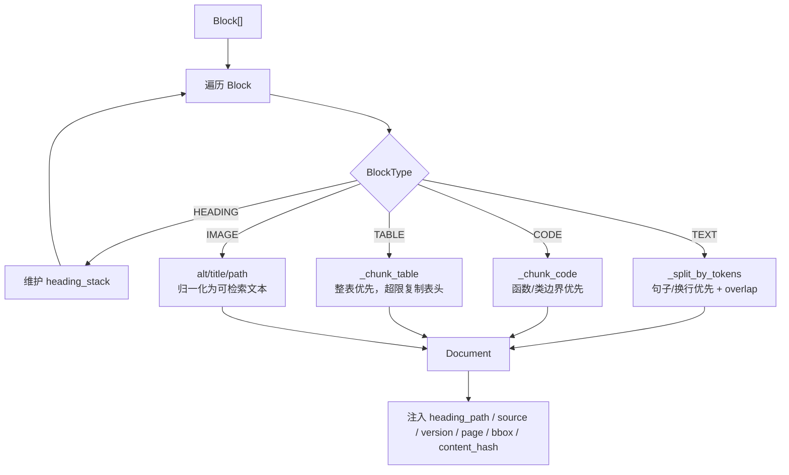

分块策略：

| 类型 | 策略 | 目的 |
| --- | --- | --- |
| 标题 | 不生成 chunk，只维护 `heading_path` | 让后续正文、表格、代码具备章节上下文。 |
| 正文 | 按句子和换行贪心打包，保留 overlap | 降低边界截断，避免固定长度切坏语义。 |
| 代码 | 优先按 `def`、`class`、`function` 等边界切 | 尽量保留函数、类或方法完整性。 |
| 表格 | 表格尽量整块；超限时每个分片复制表头 | 避免表格行脱离列名后不可理解。 |
| 图片/图表 | 独立 Markdown 图片语法会把 alt、title、path 归一化为 `image` chunk | 让图题、图例说明、文件名进入 embedding/BM25；原始视觉内容仍需视觉模型扩展。 |

图片/图表 chunk 生成时会输出 INFO 日志，便于核对 alt、title 和 path 是否被正确保留。日志来自 `rag.ingestion.chunker`：

```text
image chunk generated: doc_id=report.md chunk_index=0 heading_path='Report' content='[Report]\n图片/图表: 季度 GMV 趋势图\n标题: Q4 GMV\n路径: charts/gmv.png'
```

如果运行环境默认不显示 INFO 日志，可以在调试入口打开：

```python
import logging

logging.basicConfig(level=logging.INFO)
```

生成的 chunk 内容会把标题路径注入正文前部：

```text
[制度 > 报销]
出差报销需在 7 天内提交相关凭证...
```

这同时服务两个目标：

- embedding 阶段能看到章节语义，提升召回质量。
- 生成和返回 contexts 时能展示 `heading_path`，便于溯源和人工审核。

核心 metadata：

| 字段 | 来源 | 用途 |
| --- | --- | --- |
| `doc_id` | loader 生成 | 文档级删除、更新、manifest 主键。 |
| `source` | 当前与 `doc_id` 一致 | 返回给用户做来源展示。 |
| `version` | manifest 版本 | 文档更新后区分新旧版本。 |
| `is_latest` | 同步时写入 | 查询默认过滤最新版本。 |
| `acl` | `index(..., acl=...)` 或 CLI `--acl` | 权限过滤。 |
| `chunk_index` | chunker 递增 | 文档内定位。 |
| `block_type` | `Block.type` | 可按正文、代码、表格、图片/图表过滤。 |
| `heading_path` | 标题栈 | 章节溯源和召回增强。 |
| `start_line` / `end_line` | `Block` | 文本文件行号定位。 |
| `page` / `bbox` | `Block` | PDF/图片原文定位。 |
| `layout_confidence` | `Block.confidence` | OCR/版面质量诊断。 |
| `content_hash` | chunk 文本 SHA1 | chunk 级差分和复用统计。 |
| `token_count` | 估算 token 数 | 分块质量审计。 |

### 3.1 文档拆分原则

RAGX 的文档拆分目标不是“让每个 chunk 长度相等”，而是“让每个 chunk 在没有上下文时仍尽量可理解”。拆分策略遵循以下优先级：

1. **结构边界优先于长度边界**：标题、段落、代码块、表格块先被保留下来，再考虑 token 上限。
2. **上下文锚点必须注入 chunk**：`heading_path` 会被写入 chunk 内容和 metadata，避免“该指标”“如下表”等指代失效。
3. **局部完整性优先**：代码尽量不切断函数和类；表格尽量不切断表头；PDF 文本尽量不打乱页面阅读顺序。
4. **边界重叠只服务召回，不服务存储完整性**：正文分片允许 overlap，目的是降低答案刚好位于边界时的漏召回概率；metadata 仍按每个 chunk 独立记录。
5. **chunk 级 hash 是差分基础**：`content_hash` 应代表最终进入索引的 chunk 内容，而不是原始段落内容。

拆分粒度对召回和生成的影响：

| 粒度 | 召回影响 | 生成影响 | 典型风险 |
| --- | --- | --- | --- |
| 过小 | 精确命中容易，但语义不完整，embedding 可能只看到片段 | LLM 需要拼接多个上下文才能回答 | 答案跨 chunk 时 Recall@K 下降。 |
| 适中 | 语义和精确词兼顾 | prompt 中每条证据有独立含义 | 推荐默认状态。 |
| 过大 | 单 chunk 噪声增多，向量相似度被稀释 | prompt token 成本高，关键句可能被淹没 | Precision@K 和 NDCG@K 下降。 |

推荐调参方式：

| 参数或信号 | 调大时 | 调小时 | 观察指标 |
| --- | --- | --- | --- |
| `chunk_size` | 语义更完整，chunk 数减少 | 召回更细，source 定位更精确 | Recall@K、Precision@K、prompt token 数。 |
| `chunk_overlap` | 边界漏召回减少 | 索引膨胀减少，重复证据减少 | duplicate context ratio、source diversity。 |
| `min_chunk` | 噪声短句减少 | 标题下短事实更容易被索引 | Hit@1、Precision@1、空召回率。 |
| `heading_path` 注入 | 章节语义更强 | chunk 文本更短 | MRR、NDCG@K、metadata 命中占比。 |

### 3.2 特殊文档类型拆分

| 文档类型 | 拆分策略 | 质量检查 |
| --- | --- | --- |
| Markdown / TXT | 规则解析标题、代码围栏、表格、独立图片语法和段落 | `heading_path` 是否符合目录层级；表格是否保留表头；图片 alt/title/path 是否进入 `image` chunk。 |
| PDF 文本层 | 先按页生成有序 `Block[]`，再进入结构分块 | 双栏是否按左栏后右栏；`page/bbox` 是否透传。 |
| DOCX | loader 转为可处理文本后进入同一 chunker | 标题样式是否转成 heading；表格是否退化为可读文本。 |
| 代码文档 | 按函数/类边界优先拆分 | 单个 chunk 是否保留签名、注释和主体。 |
| 表格密集文档 | 表格作为独立块，必要时复制表头分片 | 分片是否仍可解释列含义。 |
| 图像型图表 | 当前仅索引 Markdown alt/title/path 或 OCR 可见文字 | 若需要理解柱状图、折线图、流程图语义，应接 `ModelLayoutAnalyzer` 生成图表摘要。 |

### 3.3 分块失败模式

| 现象 | 根因 | 修正方向 |
| --- | --- | --- |
| 召回到正确文档但上下文不含答案 | chunk 过大，相关句被稀释；或 chunk 过小，答案跨边界 | 调整 `chunk_size` / `overlap`，检查导出 chunks。 |
| BM25 命中文件名但正文错误 | 标题或 source metadata 权重过强，正文词项弱 | 增加正文相关性校验或交给 reranker 压制。 |
| 重排后正确证据消失 | 候选池太小，或 chunk 缺少 query 词项 | 增大 `candidate_k`，补充 heading/source 上下文。 |
| LLM 答案引用不稳定 | 多个重复 chunk 来自同一 source | 调整 source diversity penalty 或合并重复上下文。 |
| PDF 语序错乱 | 双栏未识别、bbox 异常、扫描件只走 OCR 文本 | 检查 `analyze_pdf_text_page` 输出，必要时接视觉模型。 |

## 4. 增量同步

增量同步由 `IncrementalSyncer.sync(sources, acl=...)` 完成。输入是 `{doc_id: raw_text}`，输出是 `SyncReport`。

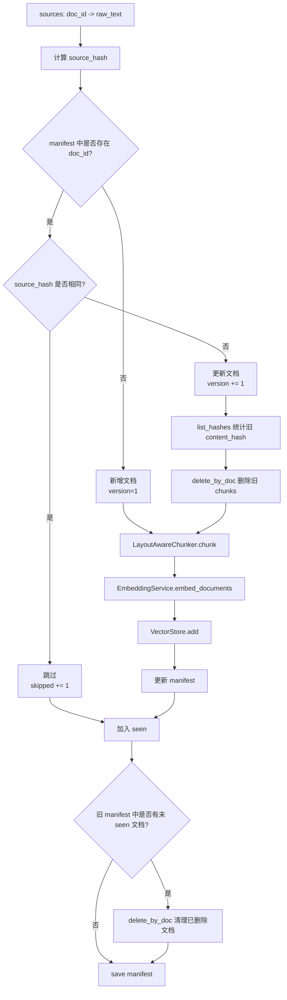

同步语义：

| 场景 | 判断 | 行为 |
| --- | --- | --- |
| 新增文档 | `doc_id` 不存在 | 分块、embedding、写入 store，`added += 1`。 |
| 未变化文档 | `source_hash` 相同 | 不分块、不 embedding，`skipped += 1`。 |
| 更新文档 | `source_hash` 变化 | 版本递增，删除旧 chunks，再写入新 chunks。 |
| 删除文档 | manifest 中存在但本次 source 不存在 | 删除该文档全部 chunks，并移除 manifest。 |
| 强制重建 | CLI `--reset` | 删除 SQLite、WAL、SHM 和 manifest 后重建。 |

`delete-then-insert` 的目标是消除孤儿向量。应用层查询还会默认加 `is_latest=True`，因此即使未来切换为保留历史版本的软删模型，也可以避免旧版本进入常规问答。

注意：当前 `content_hash` 已用于统计 `reused_chunks`，但实现仍会对新 chunks 全量 embedding。进一步优化时，可以让 vector store 根据 `content_hash` 复用旧向量，跳过未变化 chunk 的 provider 调用。

## 5. 混合检索

查询入口是 `RagApplication.ask(query, metadata_filter=None)`。应用层默认追加：

```python
metadata_filter = {"is_latest": True, **(metadata_filter or {})}
```

调用方可以继续传入：

```python
app.ask(
    "报销材料几天内提交？",
    metadata_filter={"acl": "finance", "source": "expense-rule.md"},
)
```

检索分为三段：向量召回、词法召回、RRF 融合。

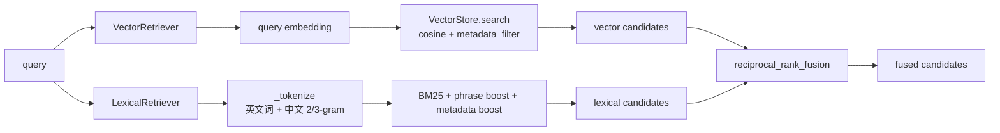

两路召回的互补关系：

| 通道 | 强项 | 弱项 |
| --- | --- | --- |
| 向量召回 | 语义相似、表达改写、问法与文档措辞不同 | 对编号、专有名词、短代码标识不一定稳定。 |
| 词法召回 | 精确词、文件名、标题、专有名词、短语 | 对同义改写和隐式语义弱。 |

RRF 融合不直接相加原始分数，而是基于排名：

```text
fused_score(doc) = Σ channel_weight / (rrf_k + rank_in_channel) + raw_score_bonus
```

当前默认参数：

| 参数 | 默认值 | 说明 |
| --- | --- | --- |
| `candidate_k` | 100 | 每路召回候选池大小。 |
| `rrf_k` | 60 | RRF 平滑参数。 |
| `vector_weight` | 1.0 | 向量通道权重。 |
| `lexical_weight` | 1.5 | 词法通道权重，增强精确词命中。 |
| `source_diversity_penalty` | 配置内定义 | 降低同 source 大量重复候选。 |

<!-- retrieval-details-anchor -->

### 5.1 向量召回

向量召回负责解决“问法和文档措辞不一致”的问题。查询先通过 `EmbeddingService` 转成 query vector，再由 `VectorStore.search` 计算相似度。SQLite 后端当前使用 Python 侧 cosine similarity：

```text
cosine(q, d) = dot(q, d) / (||q|| * ||d||)
```

向量召回的关键约束：

| 约束 | 说明 |
| --- | --- |
| embedding 维度一致 | `embedding_dim` 必须与向量库 schema 一致；pgvector 场景尤其严格。 |
| query/doc 同模型 | 建库和查询必须使用同一 embedding 模型或兼容模型。 |
| metadata filter 先过滤 | `is_latest`、`acl`、`source` 等过滤必须在候选进入融合前生效。 |
| chunk 内容要有上下文 | 如果 chunk 没有标题路径，短 chunk 的语义向量会不稳定。 |

向量召回常见失败模式：

- 文档使用专有名词，用户使用缩写或编号，embedding 不一定能稳定命中。
- chunk 太长时，关键句向量信号被其他内容稀释。
- chunk 太短时，向量只表示局部片段，缺少业务实体和章节锚点。

### 5.2 词法召回

词法召回由 `LexicalDocumentStore` 实现，使用 BM25、短语增强和 metadata 增强。中文文本没有依赖外部分词器，而是采用英文词切分 + 中文 2/3-gram：

| 文本 | 词项示例 |
| --- | --- |
| `RAG 报销` | `rag`, `报销` |
| `体验治理` | `体验`, `治理`, `体验治`, `验治理`, `体验治理` |

BM25 基础公式：

```text
score(q, d) = Σ IDF(t) * (tf(t,d) * (k1 + 1)) / (tf(t,d) + k1 * (1 - b + b * |d| / avgdl))

IDF(t) = log(1 + (N - df(t) + 0.5) / (df(t) + 0.5))
```

当前实现参数：

| 参数 | 默认值 | 说明 |
| --- | --- | --- |
| `BM25_K1` | 1.5 | 控制词频饱和速度。 |
| `BM25_B` | 0.75 | 控制文档长度归一化强度。 |

BM25 之后还会叠加：

| 补偿项 | 作用 |
| --- | --- |
| phrase boost | 查询短语在正文、标题或 source 中出现时加分，保护专有名词、短语和中文片段。 |
| metadata boost | `heading_path` 和 `source` 命中查询词时加分，提升标题和文件名可解释性。 |
| metadata filter | 与向量召回保持同一过滤口径，避免两路检索看到不同权限或版本。 |

### 5.3 RRF 融合

RRF 的核心价值是避免直接相加不同量纲的分数。向量相似度、BM25、metadata boost 的数值范围不同，直接线性相加会让某一路在不同数据集上失控。RRF 只依赖每一路内部排名，因此更稳。

生产融合分数由三部分组成：

```text
base_rrf(doc) = Σ channel_weight(c) / (rrf_k + rank_c(doc))

raw_bonus(doc) = Σ channel_weight(c) * raw_score_weight * normalized_raw_score_c(doc)

fusion_score(doc) = base_rrf(doc) + raw_bonus(doc)
```

其中：

| 符号 | 含义 |
| --- | --- |
| `rank_c(doc)` | 文档在第 `c` 路召回结果中的 1-based rank。没有出现在该路时不贡献。 |
| `rrf_k` | 平滑常量，越大越弱化 rank 差距；默认 60。 |
| `channel_weight(c)` | 通道权重；当前向量 1.0，词法 1.5。 |
| `normalized_raw_score_c` | 该通道内按最大绝对值归一化后的原始分。 |
| `raw_score_weight` | 原始分补偿权重，默认 0.05。 |

RRF 后还会做 chunk 去重和 source 多样性控制：

```text
adjusted_score = fusion_score - source_diversity_penalty * already_selected_count(source)
```

这不会改变 chunk 的原始 `score` 字段，只影响候选选择顺序。目标是避免一个 source 的多个相邻 chunk 独占 Top-K，让 prompt 有机会覆盖更多来源。需要注意，source diversity 是轻量启发式，不应替代 ACL、版本过滤或业务类别过滤。

### 5.4 Hybrid 检索排查矩阵

| 现象 | 优先检查 | 常见修正 |
| --- | --- | --- |
| 语义改写查不到 | vector hits 是否为空，embedding 模型是否一致 | 重建向量库，检查 `embedding_dim`，增加标题上下文。 |
| 专有名词查不到 | lexical hits 是否为空，tokenization 是否覆盖该词 | 增强 n-gram、source/heading boost 或术语词典。 |
| Top-K 都来自一个文件 | source diversity penalty 是否过小，chunk 是否重复 | 调整 penalty，合并重复 chunk，增大候选池。 |
| 相关文档被排在后面 | RRF 权重或 raw score 补偿不合适 | 用标注集调 `lexical_weight`、`vector_weight`、`raw_score_weight`。 |
| metadata filter 后无结果 | `acl`、`is_latest`、`source` 是否匹配 | 检查建库 metadata，避免过滤条件过严。 |

### 5.1 向量召回

向量召回负责解决“问法和文档措辞不一致”的问题。查询先通过 `EmbeddingService` 转成 query vector，再由 `VectorStore.search` 计算相似度。SQLite 后端当前使用 Python 侧 cosine similarity：

```text
cosine(q, d) = dot(q, d) / (||q|| * ||d||)
```

向量召回的关键约束：

| 约束 | 说明 |
| --- | --- |
| embedding 维度一致 | `embedding_dim` 必须与向量库 schema 一致；pgvector 场景尤其严格。 |
| query/doc 同模型 | 建库和查询必须使用同一 embedding 模型或兼容模型。 |
| metadata filter 先过滤 | `is_latest`、`acl`、`source` 等过滤必须在候选进入融合前生效。 |
| chunk 内容要有上下文 | 如果 chunk 没有标题路径，短 chunk 的语义向量会不稳定。 |

向量召回常见失败模式：

- 文档使用专有名词，用户使用缩写或编号，embedding 不一定能稳定命中。
- chunk 太长时，关键句向量信号被其他内容稀释。
- chunk 太短时，向量只表示局部片段，缺少业务实体和章节锚点。

### 5.2 词法召回

词法召回由 `LexicalDocumentStore` 实现，使用 BM25、短语增强和 metadata 增强。中文文本没有依赖外部分词器，而是采用英文词切分 + 中文 2/3-gram：

| 文本 | 词项示例 |
| --- | --- |
| `RAG 报销` | `rag`, `报销` |
| `体验治理` | `体验`, `治理`, `体验治`, `验治理`, `体验治理` |

BM25 基础公式：

```text
score(q, d) = Σ IDF(t) * (tf(t,d) * (k1 + 1)) / (tf(t,d) + k1 * (1 - b + b * |d| / avgdl))

IDF(t) = log(1 + (N - df(t) + 0.5) / (df(t) + 0.5))
```

当前实现参数：

| 参数 | 默认值 | 说明 |
| --- | --- | --- |
| `BM25_K1` | 1.5 | 控制词频饱和速度。 |
| `BM25_B` | 0.75 | 控制文档长度归一化强度。 |

BM25 之后还会叠加：

| 补偿项 | 作用 |
| --- | --- |
| phrase boost | 查询短语在正文、标题或 source 中出现时加分，保护专有名词、短语和中文片段。 |
| metadata boost | `heading_path` 和 `source` 命中查询词时加分，提升标题和文件名可解释性。 |
| metadata filter | 与向量召回保持同一过滤口径，避免两路检索看到不同权限或版本。 |

### 5.3 RRF 融合

RRF 的核心价值是避免直接相加不同量纲的分数。向量相似度、BM25、metadata boost 的数值范围不同，直接线性相加会让某一路在不同数据集上失控。RRF 只依赖每一路内部排名，因此更稳。

生产融合分数由三部分组成：

```text
base_rrf(doc) = Σ channel_weight(c) / (rrf_k + rank_c(doc))

raw_bonus(doc) = Σ channel_weight(c) * raw_score_weight * normalized_raw_score_c(doc)

fusion_score(doc) = base_rrf(doc) + raw_bonus(doc)
```

其中：

| 符号 | 含义 |
| --- | --- |
| `rank_c(doc)` | 文档在第 `c` 路召回结果中的 1-based rank。没有出现在该路时不贡献。 |
| `rrf_k` | 平滑常量，越大越弱化 rank 差距；默认 60。 |
| `channel_weight(c)` | 通道权重；当前向量 1.0，词法 1.5。 |
| `normalized_raw_score_c` | 该通道内按最大绝对值归一化后的原始分。 |
| `raw_score_weight` | 原始分补偿权重，默认 0.05。 |

RRF 后还会做 chunk 去重和 source 多样性控制：

```text
adjusted_score = fusion_score - source_diversity_penalty * already_selected_count(source)
```

这不会改变 chunk 的原始 `score` 字段，只影响候选选择顺序。目标是避免一个 source 的多个相邻 chunk 独占 Top-K，让 prompt 有机会覆盖更多来源。需要注意，source diversity 是轻量启发式，不应替代 ACL、版本过滤或业务类别过滤。

### 5.4 Hybrid 检索排查矩阵

| 现象 | 优先检查 | 常见修正 |
| --- | --- | --- |
| 语义改写查不到 | vector hits 是否为空，embedding 模型是否一致 | 重建向量库，检查 `embedding_dim`，增加标题上下文。 |
| 专有名词查不到 | lexical hits 是否为空，tokenization 是否覆盖该词 | 增强 n-gram、source/heading boost 或术语词典。 |
| Top-K 都来自一个文件 | source diversity penalty 是否过小，chunk 是否重复 | 调整 penalty，合并重复 chunk，增大候选池。 |
| 相关文档被排在后面 | RRF 权重或 raw score 补偿不合适 | 用标注集调 `lexical_weight`、`vector_weight`、`raw_score_weight`。 |
| metadata filter 后无结果 | `acl`、`is_latest`、`source` 是否匹配 | 检查建库 metadata，避免过滤条件过严。 |

### 5.1 向量召回

向量召回负责解决“问法和文档措辞不一致”的问题。查询先通过 `EmbeddingService` 转成 query vector，再由 `VectorStore.search` 计算相似度。SQLite 后端当前使用 Python 侧 cosine similarity：

```text
cosine(q, d) = dot(q, d) / (||q|| * ||d||)
```

向量召回的关键约束：

| 约束 | 说明 |
| --- | --- |
| embedding 维度一致 | `embedding_dim` 必须与向量库 schema 一致；pgvector 场景尤其严格。 |
| query/doc 同模型 | 建库和查询必须使用同一 embedding 模型或兼容模型。 |
| metadata filter 先过滤 | `is_latest`、`acl`、`source` 等过滤必须在候选进入融合前生效。 |
| chunk 内容要有上下文 | 如果 chunk 没有标题路径，短 chunk 的语义向量会不稳定。 |

向量召回常见失败模式：

- 文档使用专有名词，用户使用缩写或编号，embedding 不一定能稳定命中。
- chunk 太长时，关键句向量信号被其他内容稀释。
- chunk 太短时，向量只表示局部片段，缺少业务实体和章节锚点。

### 5.2 词法召回

词法召回由 `LexicalDocumentStore` 实现，使用 BM25、短语增强和 metadata 增强。中文文本没有依赖外部分词器，而是采用英文词切分 + 中文 2/3-gram：

| 文本 | 词项示例 |
| --- | --- |
| `RAG 报销` | `rag`, `报销` |
| `体验治理` | `体验`, `治理`, `体验治`, `验治理`, `体验治理` |

BM25 基础公式：

```text
score(q, d) = Σ IDF(t) * (tf(t,d) * (k1 + 1)) / (tf(t,d) + k1 * (1 - b + b * |d| / avgdl))

IDF(t) = log(1 + (N - df(t) + 0.5) / (df(t) + 0.5))
```

当前实现参数：

| 参数 | 默认值 | 说明 |
| --- | --- | --- |
| `BM25_K1` | 1.5 | 控制词频饱和速度。 |
| `BM25_B` | 0.75 | 控制文档长度归一化强度。 |

BM25 之后还会叠加：

| 补偿项 | 作用 |
| --- | --- |
| phrase boost | 查询短语在正文、标题或 source 中出现时加分，保护专有名词、短语和中文片段。 |
| metadata boost | `heading_path` 和 `source` 命中查询词时加分，提升标题和文件名可解释性。 |
| metadata filter | 与向量召回保持同一过滤口径，避免两路检索看到不同权限或版本。 |

### 5.3 RRF 融合

RRF 的核心价值是避免直接相加不同量纲的分数。向量相似度、BM25、metadata boost 的数值范围不同，直接线性相加会让某一路在不同数据集上失控。RRF 只依赖每一路内部排名，因此更稳。

生产融合分数由三部分组成：

```text
base_rrf(doc) = Σ channel_weight(c) / (rrf_k + rank_c(doc))

raw_bonus(doc) = Σ channel_weight(c) * raw_score_weight * normalized_raw_score_c(doc)

fusion_score(doc) = base_rrf(doc) + raw_bonus(doc)
```

其中：

| 符号 | 含义 |
| --- | --- |
| `rank_c(doc)` | 文档在第 `c` 路召回结果中的 1-based rank。没有出现在该路时不贡献。 |
| `rrf_k` | 平滑常量，越大越弱化 rank 差距；默认 60。 |
| `channel_weight(c)` | 通道权重；当前向量 1.0，词法 1.5。 |
| `normalized_raw_score_c` | 该通道内按最大绝对值归一化后的原始分。 |
| `raw_score_weight` | 原始分补偿权重，默认 0.05。 |

RRF 后还会做 chunk 去重和 source 多样性控制：

```text
adjusted_score = fusion_score - source_diversity_penalty * already_selected_count(source)
```

这不会改变 chunk 的原始 `score` 字段，只影响候选选择顺序。目标是避免一个 source 的多个相邻 chunk 独占 Top-K，让 prompt 有机会覆盖更多来源。需要注意，source diversity 是轻量启发式，不应替代 ACL、版本过滤或业务类别过滤。

### 5.4 Hybrid 检索排查矩阵

| 现象 | 优先检查 | 常见修正 |
| --- | --- | --- |
| 语义改写查不到 | vector hits 是否为空，embedding 模型是否一致 | 重建向量库，检查 `embedding_dim`，增加标题上下文。 |
| 专有名词查不到 | lexical hits 是否为空，tokenization 是否覆盖该词 | 增强 n-gram、source/heading boost 或术语词典。 |
| Top-K 都来自一个文件 | source diversity penalty 是否过小，chunk 是否重复 | 调整 penalty，合并重复 chunk，增大候选池。 |
| 相关文档被排在后面 | RRF 权重或 raw score 补偿不合适 | 用标注集调 `lexical_weight`、`vector_weight`、`raw_score_weight`。 |
| metadata filter 后无结果 | `acl`、`is_latest`、`source` 是否匹配 | 检查建库 metadata，避免过滤条件过严。 |

## 6. 重排与生成（Cross-Encoder / ColBERT）

<!-- rerank-details-anchor -->

`RagApplication.ask` 不直接把 RRF Top-K 送给 LLM，而是先扩大候选池再重排：

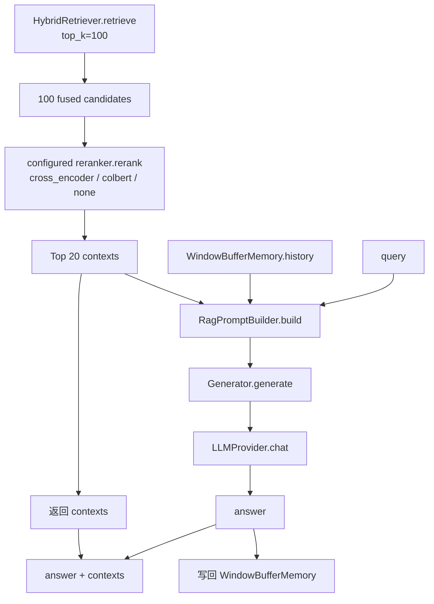

规模控制：

| 阶段 | 数量 | 目的 |
| --- | --- | --- |
| Hybrid candidate pool | 100 | 给重排器足够候选，避免小 Top-K 提前漏召回。 |
| Reranked contexts | 20 | 控制进入 prompt 的证据数量和生成成本。 |

`RagPromptBuilder` 会把 contexts 格式化为含 source、score、content 的片段，并加系统约束：只能基于上下文回答；上下文不足时必须说明无法从资料中找到答案。

返回结构：

```python
{
    "answer": "模型回答",
    "contexts": [
        {
            "source": "rule.md",
            "page": 1,
            "heading_path": "制度 > 报销",
            "version": 2,
            "score": 0.9123,
            "preview": "[制度 > 报销]\\n报销材料需要在 3 天内提交..."
        }
    ]
}
```

## 7. 建库与验证入口

正式建库脚本：

```bash
cd agent-library/ragx
python3 scripts/build_knowledge_base.py \
  --source data/resources \
  --export-chunks /tmp/ragx-chunks.json
```

常用验证：

```bash
# 静态检查
python3 -m ruff check .

# 全量测试
python3 -m pytest -q

# 只验证版面分析和分块链路
python3 -m pytest tests/test_layout.py -q

# 只验证应用建库、增量同步、检索生成链路
python3 -m pytest tests/test_app_chain.py -q
```

chunks JSON 审计重点：

| 检查项 | 异常含义 |
| --- | --- |
| `summary.document_count` | 文档读取过滤或 source 路径错误。 |
| `summary.total_chunk_count` | 分块过细、过粗或文本解析异常。 |
| `chunks[].metadata.heading_path` | 标题解析或版面顺序异常。 |
| `chunks[].metadata.block_type` | 表格、代码、正文识别异常。 |
| `chunks[].metadata.page` / `bbox` | PDF/版面模型坐标未透传。 |
| `chunks[].metadata.layout_confidence` | OCR 或版面模型质量低。 |
| `chunks[].metadata.content_hash` | chunk 级复用或差分统计依赖字段缺失。 |

## 8. 常见问题定位

| 现象 | 优先检查 |
| --- | --- |
| 建库后没有 chunks | source 是否存在、文件是否为空、正文是否低于 `min_chunk`。 |
| 更新后仍召回旧内容 | manifest 与 SQLite 是否同一路径，查询是否带 `is_latest=True`。 |
| 表格答案缺列名 | `_chunk_table` 是否复制表头，导出 chunks 是否保留 Markdown 表头。 |
| PDF 双栏内容语序异常 | 检查是否为扫描件、表格密集页或 bbox 异常；文本型 PDF 应走 `analyze_pdf_text_page`。 |
| PDF 结果无法跳页定位 | 当前读取路径是否只走 Markdown 文本；需要让建库链路直接消费带 bbox 的 `Block[]`。 |
| 精确词召回差 | 检查 `LexicalDocumentStore` tokenization、source/heading 是否写入 metadata。 |
| 语义改写召回差 | 检查 embedding provider、向量维度、vector store 是否重建。 |
| LLM 幻觉 | 检查 contexts 是否为空、prompt 是否包含证据、是否需要相关性阈值兜底。 |
| 重排后相关证据丢失 | 调大 candidate pool 或替换真实 Cross-Encoder scorer。 |

## 9. 扩展点

后续接入更强版面分析时，优先保持下游接口不变：

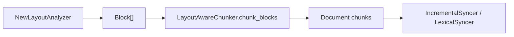

推荐扩展顺序：

1. 在 `LayoutAnalyzer.analyze` 内输出稳定阅读顺序的 `Block[]`。
2. 保证 `page`、`bbox`、`confidence` 写入 `Block`。
3. 使用现有 `StructureAwareChunker.chunk_blocks` 验证 metadata 透传。
4. 用 `--export-chunks` 审计分块结果。
5. 再运行 `evaluate_retrieval` 或标注集评估 Hit@K、MRR、source diversity。
