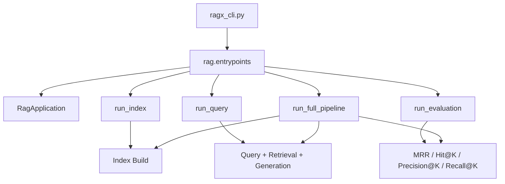

# RAGX Modular Entrypoints

This document describes the independent entrypoints for the three core RAGX
modules: indexing, query processing, and retrieval evaluation. Each module can
be called through Python Application Programming Interface (API) functions or
through a single Command-Line Interface (CLI) with subcommands.

## Abbreviation Notes

| Abbreviation | Full Name | Note |
| --- | --- | --- |
| API | Application Programming Interface | Python-callable entrypoint contract. |
| CLI | Command-Line Interface | Shell command wrapper for independent module validation. |
| JSON | JavaScript Object Notation | Machine-readable output format. |
| JSONL | JSON Lines | Evaluation dataset format with one JSON object per line. |
| MRR | Mean Reciprocal Rank | Retrieval ranking metric. |
| RAG | Retrieval-Augmented Generation | Retrieval-grounded answer generation workflow. |

See [RAGX Abbreviations](abbreviations.md) for the shared glossary.

## Architecture



The entrypoint layer only handles configuration overrides, parameter validation,
report formatting, and resource cleanup. The core Retrieval-Augmented Generation
(RAG) behavior remains in `RagApplication`.

## CLI Usage

Run commands from `agent-library/ragx`:

```bash
python ragx_cli.py index --source data/resources --reset
python ragx_cli.py query "RAGX 如何构建索引？" --top-k 3 --reranker-backend colbert
python ragx_cli.py evaluate --query "RAGX 如何构建索引？" --relevant-source rag-sample.md
python ragx_cli.py run "RAGX 如何构建索引？" --source data/resources --evaluate
```

Run commands from `agent-library`:

```bash
python ragx/ragx_cli.py index --source ragx/data/resources --reset
python ragx/ragx_cli.py query "RAGX 如何构建索引？" --top-k 3
python ragx/ragx_cli.py evaluate --query "RAGX 如何构建索引？" --relevant-source rag-sample.md
python ragx/ragx_cli.py run "RAGX 如何构建索引？" --source ragx/data/resources --evaluate
```

All subcommands support `--json` for machine-readable output.

## Index Module

Purpose: build the SQLite vector store and manifest independently.

CLI:

```bash
python ragx_cli.py index \
  --source data/resources \
  --sqlite-path data/stores/ragx-store.sqlite \
  --manifest-path data/stores/ragx-manifest.json \
  --reset \
  --json
```

API:

```python
from rag.entrypoints import run_index

result = run_index(
    "data/resources",
    sqlite_path="data/stores/ragx-store.sqlite",
    manifest_path="data/stores/ragx-manifest.json",
    reset=True,
)
```

Validation signals:

- `report.added`, `report.updated`, `report.skipped` confirm sync behavior.
- `chunk_count > 0` confirms chunks were persisted.
- `storage.store_exists` and `storage.manifest_exists` confirm storage creation.
- `count_sqlite_chunks(sqlite_path)` can independently verify loadable rows.

## Query Module

Purpose: load an existing index, retrieve evidence, and generate an answer.

CLI:

```bash
python ragx_cli.py query "RAGX 如何构建索引？" \
  --sqlite-path data/stores/ragx-store.sqlite \
  --manifest-path data/stores/ragx-manifest.json \
  --metadata-filter '{"is_latest": true}' \
  --top-k 3 \
  --json
```

API:

```python
from rag.entrypoints import run_query

result = run_query(
    "RAGX 如何构建索引？",
    sqlite_path="data/stores/ragx-store.sqlite",
    manifest_path="data/stores/ragx-manifest.json",
    reranker_backend="cross_encoder",
    metadata_filter={"is_latest": True},
    top_k=3,
)
```

Validation signals:

- `answer` confirms generation executed.
- `contexts` confirms retrieval evidence was returned.
- `context_count <= top_k` confirms the query entrypoint controls evidence count.
- `reranker_backend` confirms whether Cross-Encoder, ColBERT, or no-op reranking was used.

## Evaluation Module

Purpose: evaluate retrieval quality without invoking answer generation.

Single-query CLI:

```bash
python ragx_cli.py evaluate \
  --query "RAGX 如何构建索引？" \
  --relevant-source rag-sample.md \
  --top-k-values 1,3,5 \
  --json
```

JSONL dataset format:

```json
{"query": "RAGX 如何构建索引？", "relevant_sources": ["rag-sample.md"]}
{"query": "混合检索如何融合结果？", "relevant_doc_ids": ["hybird-search.md"]}
```

Dataset CLI:

```bash
python ragx_cli.py evaluate --dataset eval.jsonl --top-k-values 1,3,5 --json
```

API:

```python
from rag.entrypoints import run_evaluation

result = run_evaluation(
    query="RAGX 如何构建索引？",
    relevant_sources=["rag-sample.md"],
    top_k_values=(1, 3, 5),
)
```

Validation signals:

- `reports[].mrr` confirms MRR calculation.
- `reports[].hit_at_k`, `precision_at_k`, and `recall_at_k` confirm K-based metrics.
- `summary.average_mrr` and `summary.hit_rate_at_k` confirm batch aggregation.

## Full Pipeline

Purpose: compose the three modules while preserving independent entrypoints.

CLI:

```bash
python ragx_cli.py run "RAGX 如何构建索引？" \
  --source data/resources \
  --reset \
  --evaluate \
  --relevant-source rag-sample.md \
  --json
```

API:

```python
from rag.entrypoints import run_full_pipeline

result = run_full_pipeline(
    "data/resources",
    "RAGX 如何构建索引？",
    reset=True,
    evaluate=True,
    relevant_sources=["rag-sample.md"],
)
```

The returned payload contains independent `index`, `query`, and optional
`evaluation` sections, so each stage can be asserted separately in tests.

## Verification Commands

```bash
python -m ruff check rag/entrypoints.py ragx_cli.py tests/test_module_entrypoints.py
python -m pytest tests/test_module_entrypoints.py -q
python -m pytest -q --cov=. --cov-report=term-missing
```
