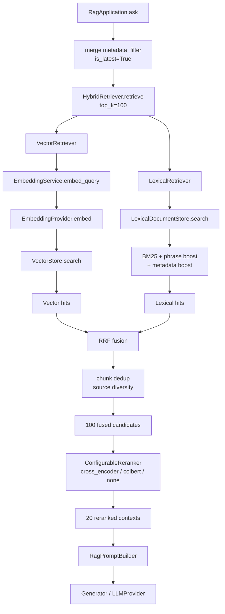
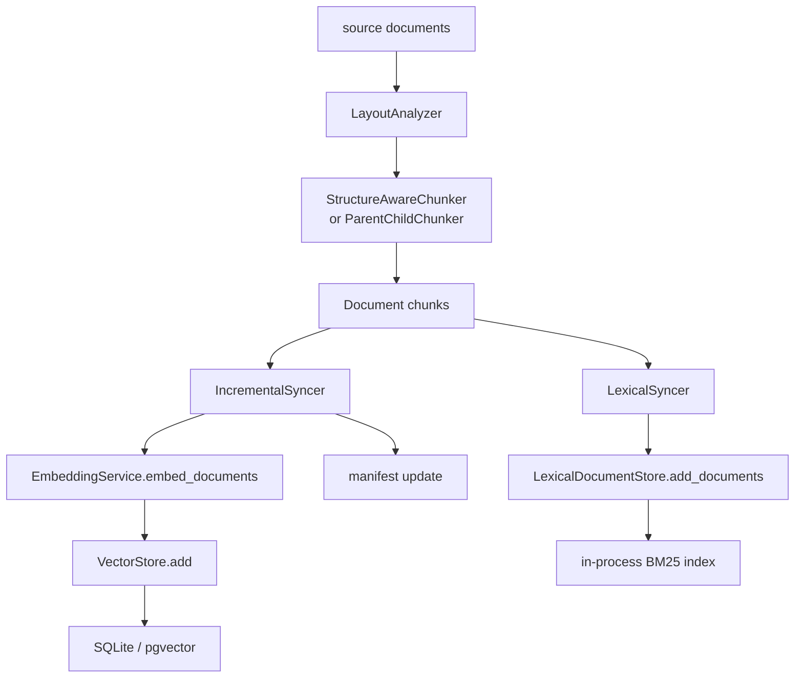
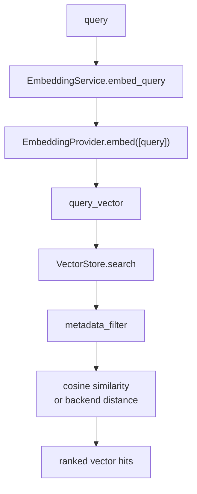
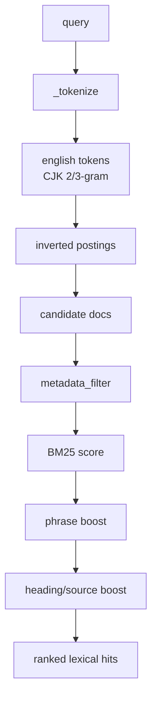
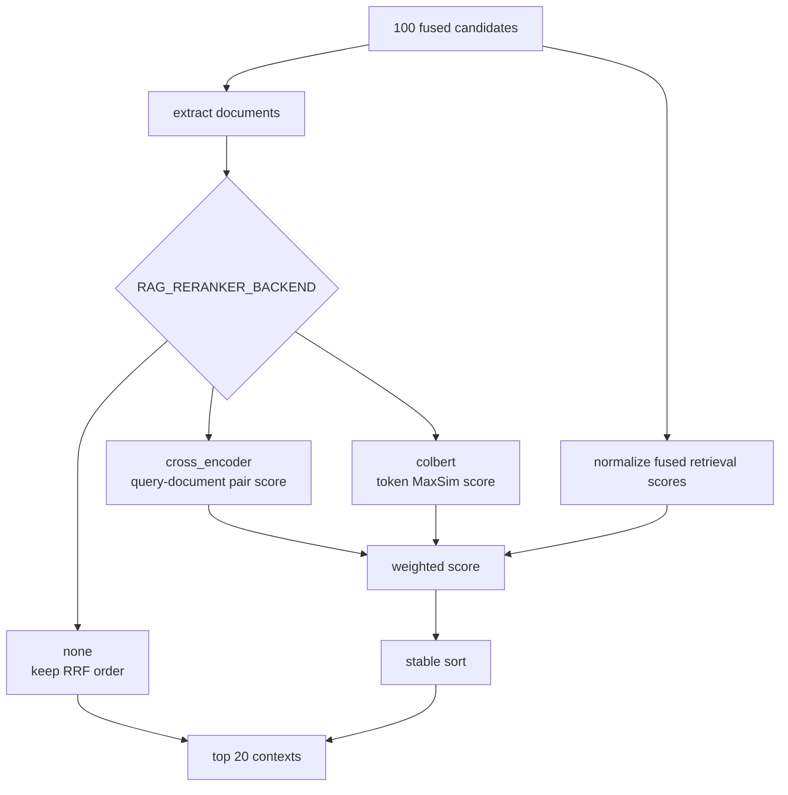

# RAGX Multi-Recall Retrieval Design

本文档说明 RAGX 多路召回的生产规则、模块边界、数据流、融合策略、重排策略、扩展方式和排查方法。当前实现的召回通道是向量召回与 Best Matching 25 (BM25) 词法召回，框架层按统一 `Retriever` 契约组织，后续可在同一规则下增加 metadata/rule-based、query rewrite、parent-child 或其他检索通道。

## 缩写说明

| 缩写 | 全称 | 说明 |
| --- | --- | --- |
| ACL | Access Control List | 访问控制列表，用于权限过滤。 |
| BM25 | Best Matching 25 | 词法相关性排序函数。 |
| CJK | Chinese, Japanese, and Korean | 中日韩字符集合。 |
| ColBERT | Contextualized Late Interaction over BERT | 基于 token-level MaxSim 的 late-interaction 检索/重排方法。 |
| ID | Identifier | 稳定标识符。 |
| LLM | Large Language Model | 大语言模型。 |
| MRR | Mean Reciprocal Rank | 平均倒数排名。 |
| NDCG | Normalized Discounted Cumulative Gain | 归一化折损累计增益。 |
| RAG | Retrieval-Augmented Generation | 检索增强生成。 |
| RRF | Reciprocal Rank Fusion | 倒数排名融合。 |

完整缩写表见 [RAGX Abbreviations](abbreviations.md)。

## 设计目标

多路召回不是把多个搜索结果简单拼接，而是把不同检索通道的优势合并到同一候选池：

| 目标 | 说明 |
| --- | --- |
| 提升 Recall | 向量召回覆盖语义改写、口语化表达、跨语言或同义问题；Best Matching 25 (BM25) 词法召回覆盖专有名词、编号、标题、代码标识符和精确短语。 |
| 降低单通道偏差 | 不假设某一路始终可靠；每一路只负责在自身排序空间内给出候选。 |
| 保持权限和版本一致 | 所有通道必须使用同一 `metadata_filter`，避免向量侧和词法侧看到不同版本或越权内容。 |
| 支持稳定扩展 | 新通道只要实现 `Retriever.retrieve(query, top_k, metadata_filter)`，即可进入融合层。 |
| 保持生成链路简单 | 召回、融合和重排只输出 `ScoredDocument`；prompt builder 与 Large Language Model (LLM) provider 不需要感知有几路召回。 |

## 核心契约

多路召回只依赖一个统一接口：

```python
class Retriever(ABC):
    def retrieve(
        self,
        query: str,
        top_k: int = 4,
        metadata_filter: dict | None = None,
    ) -> list[ScoredDocument]:
        ...
```

所有召回通道必须遵守以下规则：

| 规则 | 要求 | 原因 |
| --- | --- | --- |
| 输入一致 | `query`、`top_k`、`metadata_filter` 必须原样进入每一路通道。 | 保证不同通道面对同一个问题和同一权限/版本范围。 |
| 输出一致 | 返回 `ScoredDocument(document, score)`，且按通道内部相关性降序排列。 | 融合层只读取排序位置和轻量原始分补偿。 |
| ID 稳定 | `Document.id` 应稳定，缺失时必须能由 `metadata.doc_id/source + chunk_index` 推导。 | RRF 后需要按 chunk 去重，避免同一证据重复进入 prompt。 |
| 分数不跨路比较 | 各通道 `score` 只在本通道内有意义，不能直接跨路相加。 | BM25、cosine、规则分数的量纲不同，直接相加会让某一路失控。 |
| 过滤口径一致 | `is_latest`、ACL、source、block_type 等过滤条件必须在每一路生效。 | 避免旧版本、越权或错误类别的 chunk 混入候选池。 |
| 通道可失败但不可静默造假 | provider、索引或存储错误应直接暴露；不生成 mock 候选。 | 生产问题需要尽早暴露，避免错误结果被当成真实召回。 |

## 当前模块图



关键代码位置：

| 模块 | 职责 |
| --- | --- |
| `rag/retrieval/hybrid.py` | 编排多路召回，并把各路结果交给融合函数。 |
| `rag/retrieval/fusion.py` | RRF 融合、chunk 去重、source 多样性控制。 |
| `rag/retrieval/retriever.py` | 向量检索通道。 |
| `rag/retrieval/lexical.py` | BM25 词法检索通道。 |
| `rag/retrieval/cross_encoder.py` | 对融合候选做 query-document pair 重排。 |
| `rag/retrieval/colbert.py` | 对融合候选做 ColBERT token-level MaxSim 交互重排。 |
| `rag/retrieval/reranker.py` | 保留 cross-encoder 兼容导出，并按配置选择 reranker backend。 |
| `rag/retrieval/evaluation.py` | 评估 reranked 结果，不参与排序；详细口径见 [`docs/retrieval-evaluation.md`](retrieval-evaluation.md)。 |
| `rag/providers/factory.py` | 统一 provider 注入、注册和默认构建规则。 |

## 建库阶段：多索引同步

RAGX 在建库时同时构建向量索引和词法索引。两个索引来自同一批 chunk，metadata 和版本字段保持一致。



建库阶段的约束：

| 项 | 约束 |
| --- | --- |
| chunk 来源 | 向量索引与词法索引必须由同一个 chunker 输出，不能分别切分。 |
| manifest | 按 `doc_id -> source_hash/version/updated_at` 记录增量状态。 |
| 版本字段 | 新版本 chunk 写入 `metadata.version` 与 `metadata.is_latest=True`；旧版本在更新时删除或由过滤规避。 |
| ACL 字段 | `index(source, acl=[...])` 会把 ACL 写入 chunk metadata，查询时通过 `metadata_filter` 过滤。 |
| 词法索引 | 当前为进程内索引，随本次 `index()` 重建；持久化结果以向量库和 manifest 为准。 |

## 查询阶段：多路召回步骤

### 1. 过滤条件归一化

`RagApplication.ask(query, metadata_filter=None)` 会默认叠加：

```python
flt = {"is_latest": True}
if metadata_filter:
    flt.update(metadata_filter)
```

调用方可以追加：

| filter | 用途 |
| --- | --- |
| `acl` | 权限控制，只召回当前用户可见内容。 |
| `source` | 限定某个文件或资源来源。 |
| `doc_id` | 限定某个逻辑文档。 |
| `block_type` | 限定正文、表格、代码等结构类型。 |
| `heading_path` | 限定章节范围，适合定向问答或调试。 |

所有通道必须使用同一份 `flt`。如果某一路不支持某个 filter，应显式补齐支持或在测试中暴露，而不是悄悄忽略。

### 2. 候选池扩张

应用层固定使用两段式规模控制：

| 阶段 | 默认数量 | 说明 |
| --- | --- | --- |
| hybrid candidate pool | 100 | 召回阶段扩大候选，避免相关证据在小 Top-K 内提前丢失。 |
| reranked contexts | 20 | cross-encoder 或 ColBERT 重排后只给 prompt 传入较少上下文，控制噪声和成本。 |

`HybridRetriever` 内部还会执行：

```python
candidate_k = max(FusionConfig.candidate_k, top_k)
```

因此即使调用方请求 `top_k=4`，每一路也会先召回默认 100 条候选，再由 RRF 和 reranker 缩小。

### 3. 向量召回

向量通道解决“表达不同但语义相关”的问题：



关键规则：

| 项 | 说明 |
| --- | --- |
| provider | 由 `rag.providers` 统一解析。可直接注入，也可注册 builder，默认走 `agent_provider`。 |
| 向量维度 | SQLite 不强 schema；pgvector 依赖固定维度，模型或 `RAG_EMBEDDING_DIM` 变化后需重建 store。 |
| query/document 对称性 | 当前使用同一个 embedding provider 编码 query 与 chunk；如接入非对称模型，应在 provider 内封装差异。 |
| score 语义 | SQLite 当前使用 Python 侧 cosine similarity；其他后端可返回自身相似度，但不得假设能与 BM25 直接比较。 |

常见失败：

| 现象 | 可能原因 | 排查 |
| --- | --- | --- |
| 语义相近问题召回不到 | embedding provider 配置错误、维度不匹配、索引未重建。 | 检查 provider healthcheck、store 行数、向量维度、query vector 是否非空。 |
| 精确编号排不到前面 | 向量模型弱于字面匹配。 | 依赖词法通道和 RRF；必要时调高 `lexical_weight`。 |
| 更新后仍召回旧内容 | manifest/store 路径不一致，或 query 未带 `is_latest=True`。 | 检查 `RAG_SQLITE_PATH`、`RAG_MANIFEST_PATH` 和默认 filter。 |

### 4. 词法召回

词法通道解决“必须字面命中”的问题。`LexicalDocumentStore` 使用 BM25、短语增强和 metadata 增强，中文场景不依赖外部分词器，而是组合英文词切分与中文 2/3-gram。



BM25 基础项：

```text
score(q, d) = Σ IDF(t) * (tf(t,d) * (k1 + 1)) /
              (tf(t,d) + k1 * (1 - b + b * len(d) / avg_len))
```

当前默认参数：

| 参数 | 值 | 作用 |
| --- | --- | --- |
| `BM25_K1` | 1.5 | 控制词频饱和速度。 |
| `BM25_B` | 0.75 | 控制文档长度归一化强度。 |
| phrase boost | 代码内常量 | 对 query 中连续短语命中加权。 |
| metadata boost | 代码内常量 | 对标题路径、source、doc_id 等 metadata 命中加权。 |

词法通道特别适合：

| 查询类型 | 示例 |
| --- | --- |
| 精确编号 | “PRD-1024 的验收条件是什么？” |
| 文件名或来源 | “merchant-assistant 里的 CUI 流程” |
| 标题短语 | “报销材料提交时限” |
| 代码标识符 | “`HybridRetriever.retrieve` 的 top_k 规则” |

### 5. RRF 融合

RRF 的关键原则是“按每一路内部排名融合，而不是直接比较原始分数”。

```text
fused_score(doc) =
    Σ channel_weight / (rrf_k + rank_in_channel)
    + raw_score_bonus
```

参数位于 `FusionConfig`：

| 参数 | 默认值 | 说明 |
| --- | --- | --- |
| `candidate_k` | 100 | 每一路召回候选数量下限。 |
| `rrf_k` | 60 | 排名平滑常量；越大越平滑，越小越强调头部排名。 |
| `vector_weight` | 1.0 | 向量召回通道权重。 |
| `lexical_weight` | 1.5 | 词法召回通道权重；当前略高，保护专有名词和精确短语。 |
| `raw_score_weight` | 0.05 | 每路内部原始分的轻量补偿，先按本路最大绝对分归一化。 |
| `source_diversity_penalty` | 0.01 | 同一 source 连续占位时轻微降权，提高上下文多样性。 |

融合阶段还会做：

| 操作 | 规则 |
| --- | --- |
| chunk 去重 | 优先用 `Document.id`；缺失时用 `doc_id/source + chunk_index`。 |
| best raw score 记录 | 用于诊断，不作为跨通道主排序依据。 |
| source 多样性 | 从已融合候选中逐个选择，重复 source 会被轻微扣分。 |

### 6. 可配置重排：Cross-Encoder 或 ColBERT

RRF 输出的是召回融合候选，不是最终上下文。应用层会继续执行重排：



默认 `HeuristicCrossEncoderScorer` 是 deterministic 本地实现，用于无外部模型环境和单元测试。生产环境接真实 Cross-Encoder 时，只需实现：

```python
class MyScorer:
    def score(self, query: str, documents: Sequence[Document]) -> list[float]:
        return model_scores
```

重排器不需要理解多路召回来源。它只接收已经融合后的候选列表，并返回最终上下文。

ColBERT 重排入口是 `rag.retrieval.colbert.ColBERTReranker`。它先把 query
和候选 document 编码为 token-level vectors，再按 MaxSim 计算交互分：

```text
score(q, d) = mean_i max_j cosine(q_i, d_j)
```

ColBERT 支持两种 encoder：

| Encoder | 用途 |
| --- | --- |
| `TransformersColBERTEncoder` | 配置 `RAG_COLBERT_MODEL` 后加载 HuggingFace 模型，需要安装 `torch` 与 `transformers`。 |
| `HashingColBERTEncoder` | 未配置模型时使用的确定性本地 encoder，用于单元测试、功能测试和无模型环境验证。 |

相关配置和性能对比见 [`docs/reranking-strategies.md`](reranking-strategies.md)。

## Provider 注入与多路召回的关系

Provider 只负责模型能力，不负责检索策略：

| Provider | 使用位置 | 规则 |
| --- | --- | --- |
| Embedding provider | 向量召回建库与查询阶段。 | 必须暴露 `embed(texts)`。 |
| LLM provider | 最终生成阶段。 | 必须暴露 `chat(messages, **kwargs)`。 |
| Cross-Encoder scorer | reranking 阶段。 | 必须暴露 `score(query, documents)`，不是 LLM provider。 |
| ColBERT encoder | reranking 阶段。 | 必须暴露 `encode_queries` 与 `encode_documents`，不是 embedding provider。 |

RAGX 支持两类外部 provider 接入：

```python
from rag.app import RagApplication
from rag.providers import ProviderBundle, register_provider

# 方式一：直接注入已经初始化好的实例
app = RagApplication(
    cfg,
    providers=ProviderBundle(embedding=my_embedding, llm=my_llm),
)

# 方式二：注册 builder，之后由 cfg.provider 或显式 name 选择
register_provider(
    "my-provider",
    embedding_builder=lambda cfg: my_embedding_builder(cfg),
    llm_builder=lambda cfg: my_llm_builder(cfg),
    overwrite=True,
)
app = RagApplication(cfg_with_provider_name)
```

这两种方式遵守同一规则：RAGX 只检查对象是否具备 `embed` 和 `chat` 能力，不在检索链路中写厂商或平台判断。

## 扩展新召回通道

新增召回通道时建议按以下步骤实施：

1. 实现 `Retriever.retrieve(query, top_k, metadata_filter)`。
2. 返回稳定 `Document.id` 与完整 metadata。
3. 保证内部结果按本通道相关性降序排列。
4. 在 `HybridRetriever` 或新的编排器中加入通道列表。
5. 在 `FusionConfig` 中增加对应权重，或把权重改为 channel-name 映射。
6. 补充单元测试：filter 转发、candidate_k 扩张、RRF 排名、去重和降级行为。
7. 用标注集评估 Hit@K、Precision@K、Recall@K、MRR；评估细节见 [`docs/retrieval-evaluation.md`](retrieval-evaluation.md)。若有 graded relevance，再补 NDCG@K。

候选通道示例：

| 通道 | 适用场景 | 注意事项 |
| --- | --- | --- |
| metadata/rule recall | 明确 source、doc_id、标题路径、时间范围过滤。 | 不能绕过 ACL；规则命中分只在本通道内部排序。 |
| query rewrite recall | 对口语化、缩写、错别字 query 生成多个改写。 | 改写后的候选仍需回到同一 RRF 融合，不直接覆盖原 query。 |
| parent-child recall | 子块召回后扩展到父块上下文。 | 父块不能破坏原 chunk 的权限和版本 metadata。 |
| graph/entity recall | 根据实体关系扩展相关文档。 | 必须限制扩展半径，避免候选池噪声膨胀。 |

## 调参顺序

优先按以下顺序调参，避免直接改模型或扩大 prompt：

| 顺序 | 调整项 | 判断依据 |
| --- | --- | --- |
| 1 | chunk 结构与 metadata | 如果正确证据根本不在任何通道候选中，先看分块和 metadata。 |
| 2 | `candidate_k` | 如果正确证据在 Top100 之外，扩大召回候选或优化索引。 |
| 3 | `lexical_weight/vector_weight` | 如果正确证据能召回但融合后靠后，再调权重。 |
| 4 | `rrf_k` | 如果头部候选波动大，适当增大；如果头部强命中不够突出，适当减小。 |
| 5 | reranker backend | 如果融合候选包含正确证据但最终上下文排序错，优先比较 cross-encoder 与 ColBERT。 |
| 6 | prompt top_k | 只有在重排 Top20 已足够准确但答案缺上下文时，再调整进入 prompt 的数量。 |

## 排查矩阵

| 现象 | 定位层 | 处理方式 |
| --- | --- | --- |
| 两路都没有正确证据 | 分块、索引、metadata_filter | 检查 chunk JSON、store 行数、manifest、filter 是否过严。 |
| 向量有证据，词法没有 | tokenization 或文档措辞 | 检查中文 n-gram、标题/source 是否进入 metadata；必要时增加 alias 或短语增强。 |
| 词法有证据，向量没有 | embedding provider 或语义模型 | 检查 provider 配置、embedding 维度、向量库是否重建。 |
| 融合后正确证据靠后 | RRF 参数 | 调 `lexical_weight`、`vector_weight`、`rrf_k`，并用标注集验证。 |
| rerank 后正确证据被压低 | reranker backend | 检查 `RAG_RERANKER_BACKEND`、query normalization、真实模型输出和权重配置。 |
| 上下文里同一文件重复过多 | 多样性控制 | 调 `source_diversity_penalty`，或在 chunker 层降低重复。 |
| 返回旧版本 | 版本过滤 | 确认 `is_latest=True` 默认 filter 生效，检查更新时是否清理旧 chunk。 |
| 结果越权 | ACL 过滤 | 确认每一路 retriever 都执行同一 `metadata_filter`。 |

## 验收清单

多路召回改动完成后，至少验证：

| 检查项 | 期望 |
| --- | --- |
| filter 转发 | vector 与 lexical 都收到同一 `metadata_filter`。 |
| candidate_k 扩张 | 请求小 Top-K 时，每一路仍按 `candidate_k` 拉大候选。 |
| 去重 | 同一 `Document.id` 不会重复进入融合结果。 |
| 权重影响 | 调整 `lexical_weight/vector_weight` 能按预期影响排序。 |
| source 多样性 | 同 source 连续占位时会被轻微惩罚。 |
| rerank 截断 | 默认从 100 fused candidates 选出 20 contexts，backend 可为 cross-encoder 或 ColBERT。 |
| provider 注入 | 直接 provider 和 registry provider 都能被应用层使用。 |
| 评估指标 | 有标注时输出 Hit@K、Precision@K、Recall@K、MRR；无标注时输出健康诊断。 |
