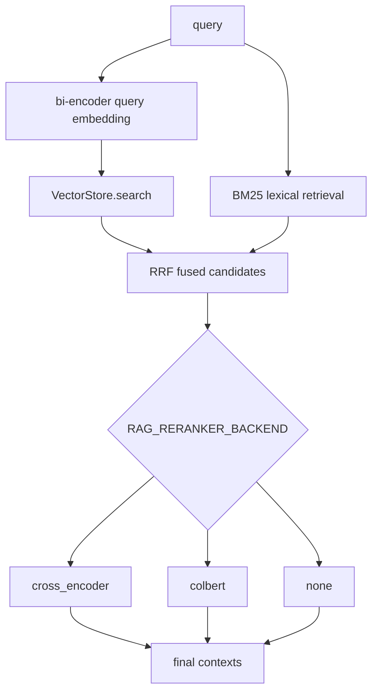
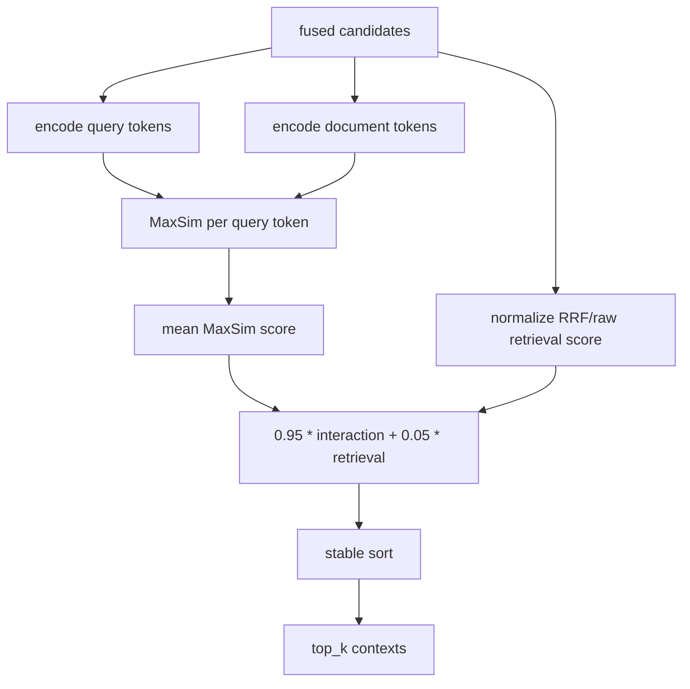

# RAGX Reranking Strategies

本文说明 RAGX 中默认 bi-encoder 搜索、Cross-Encoder 重排和 ColBERT late-interaction 重排的职责边界、配置项、使用方法和性能取舍。

## 缩写说明

| 缩写 | 全称 | 说明 |
| --- | --- | --- |
| BM25 | Best Matching 25 | 词法相关性排序函数。 |
| ColBERT | Contextualized Late Interaction over BERT | 基于 token-level MaxSim 的 late-interaction 检索/重排方法。 |
| LLM | Large Language Model | 大语言模型。 |
| RAG | Retrieval-Augmented Generation | 检索增强生成。 |
| RRF | Reciprocal Rank Fusion | 倒数排名融合。 |

完整缩写表见 [RAGX Abbreviations](abbreviations.md)。

## 默认搜索配置

RAGX 的默认搜索配置是 `bi_encoder` 候选搜索：

1. 建库时使用 embedding provider 独立编码文档 chunk，写入 SQLite 或 pgvector。
2. 查询时使用同一个 embedding provider 独立编码 query，执行向量召回。
3. 同时执行 Best Matching 25 (BM25) 词法召回。
4. 使用 Reciprocal Rank Fusion (RRF) 融合向量与词法候选。
5. 通过 `RAG_RERANKER_BACKEND` 选择是否执行二阶段重排。



`RAG_SEARCH_BACKEND` 当前默认并只支持 `bi_encoder`，用于显式标注候选搜索形态。`RAG_RERANKER_BACKEND` 决定融合候选后的排序策略。

## Cross-Encoder 方案分析

Cross-Encoder 对每个 `(query, document)` pair 做联合编码和相关性打分。RAGX 保留原入口 `rag.retrieval.cross_encoder.CrossEncoderReranker` 与兼容函数 `rank_by_relevance`，默认配置仍使用 cross-encoder 重排，保证已有调用不变。

优势：

| 优势 | 说明 |
| --- | --- |
| 精排质量高 | query 与 document 在同一模型前向中交互，能捕获词序、否定、上下文指代和细粒度语义。 |
| 接入边界清晰 | 只需要对融合候选打分，不改变向量库 schema、chunk metadata 或 RRF 融合逻辑。 |
| 对候选池鲁棒 | 当前实现把 Cross-Encoder 分数与少量召回原始分融合，能降低同分或低置信候选抖动。 |
| 适合 Top-N 精排 | 在候选数量受控时，精排收益通常高于单纯扩大 prompt Top-K。 |

劣势：

| 劣势 | 影响 |
| --- | --- |
| 延迟随候选数线性增长 | 100 个候选意味着 100 个 query-document pair 前向，在线高并发成本明显。 |
| 难以预计算文档侧表示 | query 与 document 联合编码，文档向量不能像 bi-encoder 一样提前复用。 |
| 长文档截断敏感 | 单个 chunk 过长会被模型截断，关键证据可能不在输入窗口内。 |
| 训练/模型依赖强 | 真实生产 scorer 需要领域适配模型；当前本地启发式 scorer 只用于无模型测试与离线验证。 |

适用场景：

| 场景 | 推荐 |
| --- | --- |
| 候选池已经较小，追求最终 Top-K 精度 | 使用 `cross_encoder`。 |
| 查询复杂、否定或条件多 | 使用真实 Cross-Encoder scorer。 |
| 高并发、低延迟、候选池很大 | 谨慎使用，优先缩小候选池或改用 ColBERT/蒸馏模型。 |

## ColBERT 方案

ColBERT 使用 token-level 向量执行 late interaction。RAGX 的实现位于 `rag/retrieval/colbert.py`，包含：

| 组件 | 职责 |
| --- | --- |
| `ColBERTEncoder` | token-level 编码协议，定义 `encode_queries` 与 `encode_documents`。 |
| `TransformersColBERTEncoder` | 可选 HuggingFace 模型加载器，依赖 `torch` 和 `transformers`。 |
| `HashingColBERTEncoder` | 无依赖的确定性 token encoder，用于本地测试和离线验证。 |
| `ColBERTReranker` | 对 RRF 融合候选执行 MaxSim 交互打分，并输出排序后的 `ScoredDocument`。 |
| `rank_by_colbert` | ColBERT 兼容入口，独立于原 Cross-Encoder 入口。 |

ColBERT 排序流程：



MaxSim 公式：

```text
score(q, d) = mean_i max_j cosine(q_i, d_j)
```

RAGX 将 MaxSim 映射到 `0..1`，再与归一化召回分数做轻量融合，避免多个候选 interaction 分数接近时排序不稳定。

## 配置项

| 配置 | 默认值 | 说明 |
| --- | --- | --- |
| `RAG_SEARCH_BACKEND` | `bi_encoder` | 候选搜索配置；当前只支持默认 bi-encoder 搜索。 |
| `RAG_RERANKER_BACKEND` | `cross_encoder` | 二阶段重排策略：`cross_encoder`、`colbert` 或 `none`。 |
| `RAG_CROSS_ENCODER_WEIGHT` | `0.95` | Cross-Encoder 分数权重。 |
| `RAG_CROSS_ENCODER_RETRIEVAL_SCORE_WEIGHT` | `0.05` | Cross-Encoder 阶段原召回分数稳定项权重。 |
| `RAG_COLBERT_MODEL` | 空 | HuggingFace 模型名；为空时使用本地确定性 encoder。 |
| `RAG_COLBERT_QUERY_MAX_TOKENS` | `32` | ColBERT 查询 token 上限。 |
| `RAG_COLBERT_DOCUMENT_MAX_TOKENS` | `180` | ColBERT 文档 token 上限。 |
| `RAG_COLBERT_BATCH_SIZE` | `8` | Transformers 模型编码 batch size。 |
| `RAG_COLBERT_INTERACTION_WEIGHT` | `0.95` | ColBERT MaxSim 交互分权重。 |
| `RAG_COLBERT_RETRIEVAL_SCORE_WEIGHT` | `0.05` | ColBERT 阶段原召回分数稳定项权重。 |
| `RAG_COLBERT_HASHING_DIM` | `64` | 本地确定性 encoder 的 token 向量维度。 |

## 使用示例

默认 Cross-Encoder：

```bash
cd agent-library/ragx
RAG_RERANKER_BACKEND=cross_encoder \
python3 ragx_cli.py query "报销材料几天内提交？" --top-k 3
```

ColBERT 本地验证：

```bash
cd agent-library/ragx
RAG_RERANKER_BACKEND=colbert \
python3 ragx_cli.py query "报销材料几天内提交？" --top-k 3
```

ColBERT 加载 HuggingFace 模型：

```bash
cd agent-library/ragx
python3 -m pip install torch transformers
RAG_RERANKER_BACKEND=colbert \
RAG_COLBERT_MODEL=colbert-ir/colbertv2.0 \
python3 ragx_cli.py query "报销材料几天内提交？" --top-k 3
```

CLI 直接覆盖 reranker：

```bash
cd agent-library/ragx
python3 ragx_cli.py query "RAGX 如何检索？" \
  --reranker-backend colbert \
  --top-k 3
```

Python API：

```python
from config.settings import Settings
from rag.app import RagApplication

cfg = Settings(provider="openai", reranker_backend="colbert")
app = RagApplication(cfg)
result = app.ask("报销材料几天内提交？", top_k=3)
```

关闭二阶段重排，仅使用 bi-encoder + BM25 + RRF：

```bash
cd agent-library/ragx
RAG_RERANKER_BACKEND=none \
python3 ragx_cli.py query "报销材料几天内提交？"
```

## 性能与效果对比

| 方案 | 文档侧预计算 | Query 延迟 | 内存/存储 | 排序质量 | 适用场景 |
| --- | --- | --- | --- | --- | --- |
| bi-encoder + BM25 + RRF | 是 | 低 | 低 | 中等，依赖 embedding 与词法互补 | 默认搜索、召回扩大、低延迟场景。 |
| Cross-Encoder reranking | 否 | 高，近似 O(candidate_count) 模型前向 | 低 | 高，pair 级交互最充分 | 小候选池、高精度精排。 |
| ColBERT reranking | 文档 token 向量可预计算；当前 RAGX 对候选即时编码 | 中到高，MaxSim 可批量化 | 中高，token-level 向量更多 | 高于普通 bi-encoder，通常低于强 Cross-Encoder | 需要更多交互能力但希望保留文档侧表示复用空间。 |

当前 RAGX 的 ColBERT 实现为了兼容现有 SQLite/pgvector schema，先作为融合候选的 late-interaction reranker 接入。若后续要把 ColBERT 作为第一阶段召回，需要新增 token-level multi-vector index、持久化 schema 和近似 MaxSim 检索，这会改变当前向量库接口。

## 验证命令

```bash
cd agent-library/ragx
python3 -m ruff check rag/retrieval/colbert.py rag/retrieval/reranker.py
python3 -m pytest tests/test_colbert_retrieval.py -q
python3 -m pytest tests/test_hybrid_retrieval.py -q
```

功能验收重点：

| 检查项 | 期望 |
| --- | --- |
| 默认搜索 | `search_backend=bi_encoder`。 |
| cross-encoder | `RAG_RERANKER_BACKEND=cross_encoder` 下原入口正常返回 contexts。 |
| ColBERT | `RAG_RERANKER_BACKEND=colbert` 下可建库、查询并输出 contexts。 |
| 隔离性 | 两个 reranker backend 只影响重排策略，不改变 indexing、metadata filter、vector store 和 BM25 索引。 |
| 可选依赖 | 未安装 `torch/transformers` 时仍可用本地 encoder 测试；配置 `RAG_COLBERT_MODEL` 后缺依赖会输出明确安装指引。 |
