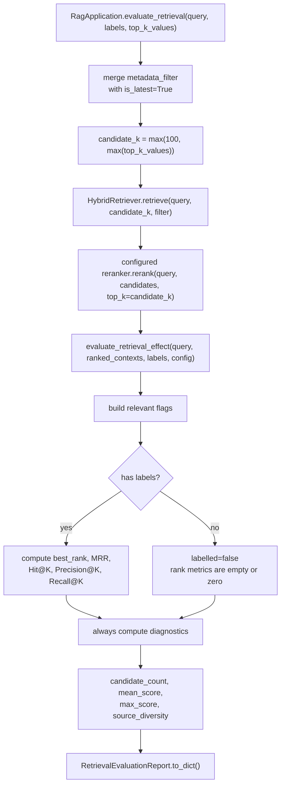
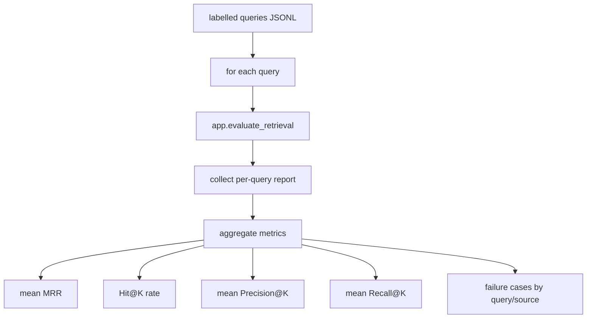

# RAGX Retrieval Evaluation Design

本文档说明 RAGX 检索评估逻辑的职责边界、调用链路、指标定义、标注规则、输出结构和排查方式。评估模块只评估已经完成召回、融合和 reranking 的排序结果，不参与召回排序，也不触发 Large Language Model (LLM，大语言模型) 生成。

## 缩写说明

| 缩写 | 全称 | 说明 |
| --- | --- | --- |
| BM25 | Best Matching 25 | 词法相关性排序函数。 |
| ColBERT | Contextualized Late Interaction over BERT | 基于 token-level MaxSim 的 late-interaction 检索/重排方法。 |
| LLM | Large Language Model | 大语言模型。 |
| MRR | Mean Reciprocal Rank | 平均倒数排名。 |
| NDCG | Normalized Discounted Cumulative Gain | 归一化折损累计增益。 |
| RAG | Retrieval-Augmented Generation | 检索增强生成。 |
| RRF | Reciprocal Rank Fusion | 倒数排名融合。 |

完整缩写表见 [RAGX Abbreviations](abbreviations.md)。

## 目标与边界

RAGX 的检索评估用于回答三个问题：

| 问题 | 评估目标 |
| --- | --- |
| 正确证据有没有被召回？ | 看 Hit@K、Recall@K、best_rank。 |
| 正确证据排得是否足够靠前？ | 看 Mean Reciprocal Rank (MRR，平均倒数排名)、Precision@K、Top-K 窗口内相关证据密度。 |
| 没有标注时检索是否健康？ | 看 candidate_count、mean_score、max_score、source_diversity。 |

职责边界：

| 层级 | 职责 | 是否评估 |
| --- | --- | --- |
| `HybridRetriever` | 向量召回 + Best Matching 25 (BM25) 词法召回 + Reciprocal Rank Fusion (RRF) 融合。 | 否，只产出候选。 |
| configurable reranker | 按 `RAG_RERANKER_BACKEND` 对融合候选做 Cross-Encoder、ColBERT 或 no-op 重排。 | 否，只产出排序结果。 |
| `RagApplication.evaluate_retrieval` | 执行一次完整检索和重排，并把结果交给评估函数。 | 是，应用层入口。 |
| `evaluate_retrieval_effect` | 只评估已排序的 `ScoredDocument` 列表。 | 是，纯函数评估。 |
| `Generator / LLMProvider` | 根据上下文调用 Large Language Model (LLM) 生成答案。 | 否，评估入口不会调用。 |

## 调用链路



关键点：

| 步骤 | 规则 |
| --- | --- |
| filter 合并 | 默认强制 `is_latest=True`，调用方传入的 `metadata_filter` 会叠加。 |
| candidate pool | 评估时 `candidate_k=max(DEFAULT_RETRIEVAL_CANDIDATE_K, max(top_k_values))`，默认至少 100。 |
| reranking | 评估使用配置后的 reranked 结果，而不是只看 RRF 融合结果。 |
| 不触发生成 | 评估不调用 prompt builder、generator 或 LLM provider。 |
| 输出格式 | `RetrievalEvaluationReport.to_dict()` 返回 JSON 友好的字典。 |

## API 入口

### 应用层入口

```python
report = app.evaluate_retrieval(
    "报销材料几天内提交？",
    relevant_sources=["rule.md"],
    top_k_values=(1, 3, 5),
)
```

参数语义：

| 参数 | 类型 | 说明 |
| --- | --- | --- |
| `query` | `str` | 用户查询文本。 |
| `metadata_filter` | `dict | None` | 可选过滤条件，应用层会自动叠加 `is_latest=True`。 |
| `relevant_sources` | `list[str] | None` | 标注相关 source 文件名。 |
| `relevant_doc_ids` | `list[str] | None` | 标注相关逻辑文档 ID。 |
| `relevant_chunk_ids` | `list[str] | None` | 标注相关 chunk ID。 |
| `top_k_values` | `tuple[int, ...]` | 指标窗口，默认 `(1, 3, 5)`；非法 K 会在底层过滤。 |

### 纯函数入口

```python
report = evaluate_retrieval_effect(
    query="报销材料",
    ranked_contexts=contexts,
    relevant_sources=["rule.md"],
    config=EvaluationConfig(top_k_values=(1, 3, 5)),
)
```

`evaluate_retrieval_effect` 适合离线评估脚本直接复用：调用方可以自己准备任意已排序 `ScoredDocument` 列表，不必依赖 `RagApplication`。

## 标注匹配规则

RAGX 当前使用二值相关性标注：命中 source、doc_id 或 chunk_id 任意一种，即认为该候选相关。

```python
relevant = (
    source in relevant_sources
    or doc_id in relevant_doc_ids
    or chunk_id in relevant_chunk_ids
)
```

字段来源：

| 标注字段 | 候选中读取的位置 | 适用场景 |
| --- | --- | --- |
| `relevant_sources` | `hit.document.metadata["source"]` | 文件级或资源级标注，例如 `rule.md`。 |
| `relevant_doc_ids` | `hit.document.metadata["doc_id"]` | 逻辑文档级标注，适合文档重命名或多 source 汇聚场景。 |
| `relevant_chunk_ids` | `hit.document.id` | chunk 级精确标注，适合回归测试和细粒度调参。 |

标注建议：

| 场景 | 推荐粒度 |
| --- | --- |
| 快速回归 | `source`。维护成本低，适合文档级问答。 |
| 多版本文档 | `doc_id` + `metadata_filter`。避免 source 名称变化影响评估。 |
| 检索调参 | `chunk_id`。可以精确判断目标证据是否进入 Top-K。 |
| 多答案问题 | 同时传多个 source/doc_id/chunk_id，任意命中都算相关。 |

## 指标定义

### labelled

```text
labelled = bool(relevant_sources or relevant_doc_ids or relevant_chunk_ids)
```

有标注时计算排序指标；无标注时排序指标为空或 0，只输出健康诊断。

### best_rank

```text
best_rank = first 1-based rank where relevant_flags[rank - 1] is true
```

如果没有相关候选，`best_rank=None`。

### MRR

```text
MRR = 1 / best_rank
```

当前实现是单 query 报告，因此 `mrr` 表示该 query 的 reciprocal rank。离线批量评估时，应对多条 query 的 `mrr` 求平均。

| best_rank | MRR |
| --- | --- |
| 1 | 1.0 |
| 2 | 0.5 |
| 5 | 0.2 |
| None | 0.0 |

### Hit@K

```text
Hit@K = any(relevant_flags[:K])
```

Hit@K 只判断 Top-K 内是否至少出现一个相关候选，适合衡量“目标证据有没有进入上下文窗口”。

### Precision@K

```text
Precision@K = relevant_count_in_top_k / min(K, candidate_count)
```

Precision@K 反映 Top-K 窗口里的相关证据密度。候选数量小于 K 时，分母使用实际候选数量。

### Recall@K

```text
Recall@K = relevant_count_in_top_k / total_relevant_in_ranked_contexts
```

注意：当前实现的 `total_relevant_in_ranked_contexts` 是本次候选列表中被标注命中的相关候选数量，而不是全量语料中的真实相关总数。因此它更准确地说是“候选池内 Recall@K”。如果要计算全语料级 Recall@K，需要离线标注集提供每个 query 的完整 relevant set。

### mean_score / max_score

```text
mean_score = average(hit.score for hit in ranked_contexts)
max_score = max(hit.score for hit in ranked_contexts)
```

这两个指标只做健康诊断，不能跨不同 scorer、不同 query 或不同数据集直接比较。

### source_diversity

```text
source_diversity = unique_source_count / candidate_count
```

`source_diversity` 范围为 0-1：

| 数值 | 含义 |
| --- | --- |
| 接近 1 | 候选来自多个 source，覆盖更分散。 |
| 接近 0 | 候选高度集中在少数 source，可能有重复上下文。 |
| 0 | 没有候选。 |

## 输出结构

`RetrievalEvaluationReport.to_dict()` 输出：

```json
{
  "query": "报销材料几天内提交？",
  "candidate_count": 20,
  "labelled": true,
  "best_rank": 1,
  "mrr": 1.0,
  "hit_at_k": {"1": true, "3": true, "5": true},
  "precision_at_k": {"1": 1.0, "3": 0.333333, "5": 0.2},
  "recall_at_k": {"1": 1.0, "3": 1.0, "5": 1.0},
  "mean_score": 0.412345,
  "max_score": 0.91,
  "source_diversity": 0.35
}
```

Python 字典中 `hit_at_k`、`precision_at_k`、`recall_at_k` 的 key 是整数；序列化为 JSON 后会变成字符串 key。

无标注时：

```json
{
  "labelled": false,
  "best_rank": null,
  "mrr": 0.0,
  "hit_at_k": {},
  "precision_at_k": {},
  "recall_at_k": {}
}
```

## 与生成评估的区别

检索评估只回答“证据是否被找到并排到前面”。它不判断最终答案是否忠实、完整或可读。

| 评估类型 | 输入 | 输出 | 是否调用 LLM |
| --- | --- | --- | --- |
| 检索评估 | query + ranked contexts + labels | Hit@K、MRR、Precision@K、Recall@K、诊断指标 | 否 |
| 生成评估 | query + answer + contexts + reference answer | faithfulness、answer correctness、引用质量 | 是或可选 |
| 端到端评估 | query + final answer + labels | 业务通过率、人工评分、失败原因 | 通常是 |

因此，检索评估通过不代表答案一定正确；检索评估失败时，生成质量通常也会受影响。

## 离线评估建议

推荐构造 JSONL 标注集：

```jsonl
{"query": "报销材料几天内提交？", "relevant_sources": ["rule.md"], "top_k_values": [1, 3, 5]}
{"query": "HybridRetriever 的 candidate_k 怎么算？", "relevant_doc_ids": ["docs/multi-recall.md"]}
```

批量评估流程：



批量聚合建议：

| 指标 | 聚合方式 |
| --- | --- |
| MRR | 对每条 query 的 `mrr` 求平均。 |
| Hit@K | 计算 `hit_at_k[K] == true` 的 query 占比。 |
| Precision@K | 对每条 query 的 `precision_at_k[K]` 求平均。 |
| Recall@K | 对每条 query 的 `recall_at_k[K]` 求平均。 |
| candidate_count | 看均值、P50/P95 和 0 候选比例。 |
| source_diversity | 看均值与低分 query 列表。 |

## NDCG@K 说明

当前代码没有实现 NDCG@K，因为评估标注是二值集合，不包含 graded relevance。如果需要 NDCG@K，需要把标注扩展为分级相关性，例如：

```json
{
  "query": "报销材料几天内提交？",
  "relevance": {
    "rule.md::0": 3,
    "rule.md::1": 1
  }
}
```

NDCG@K 公式：

```text
DCG@K = Σ (2^rel_i - 1) / log2(i + 1)
IDCG@K = ideal ranking DCG@K
NDCG@K = DCG@K / IDCG@K
```

接入 NDCG@K 前应先明确：

| 决策 | 说明 |
| --- | --- |
| relevance 粒度 | source、doc_id 还是 chunk_id。 |
| 等级范围 | 例如 0-3 或 0-5。 |
| 多证据问题 | 多个 chunk 是否都算强相关。 |
| 聚合方式 | macro average 还是按 query 权重加权。 |

## 排查矩阵

| 现象 | 可能原因 | 排查方式 |
| --- | --- | --- |
| `candidate_count=0` | filter 过严、索引为空、source 未建库。 | 检查 `metadata_filter`、manifest、SQLite chunks 行数。 |
| `labelled=false` | 没传任何 relevant labels。 | 确认调用方传入 `relevant_sources/doc_ids/chunk_ids`。 |
| Hit@K 全 false | 正确证据未进入 reranked candidates。 | 先检查多路召回候选，再检查 reranker 是否压低正确证据。 |
| MRR 低但 Hit@K 高 | 正确证据进入窗口但排名靠后。 | 调 RRF 权重或 Cross-Encoder scorer。 |
| Precision@K 低 | Top-K 噪声多。 | 优化 chunk、metadata filter、reranker，或降低进入 prompt 的上下文数量。 |
| Recall@K 低 | 多个相关证据分散在靠后位置。 | 增大 candidate_k，检查 source diversity 和 reranker。 |
| source_diversity 过低 | 同一 source 重复 chunk 太多。 | 调 `source_diversity_penalty`，或在 chunker 层降低重复。 |
| mean_score/max_score 波动大 | scorer 或 query 分布变化。 | 不跨模型直接比较分数，优先看排序指标。 |

## 验收清单

评估逻辑变更后至少验证：

| 检查项 | 期望 |
| --- | --- |
| 有标注命中 | `best_rank`、`mrr`、Hit@K、Precision@K、Recall@K 正确。 |
| 有标注未命中 | `best_rank=None`、`mrr=0`、Hit@K false。 |
| 无标注 | `labelled=false`，排序指标为空，诊断指标仍输出。 |
| K 值过滤 | 非法 K 被过滤，重复 K 去重排序。 |
| 空候选 | `candidate_count=0`，mean/max/source_diversity 均为 0。 |
| filter 合并 | 应用层评估默认带 `is_latest=True`。 |
| 不触发生成 | 评估路径不调用 LLM provider。 |
